# Build on Polkadot

**Narratives, Resources and Growth**

**Presenter:** Tin

**Workshop Focus:** Maximizing community resources and understanding key narratives

---

## 📺 Workshop Recording

<iframe width="100%" height="600px" src="https://www.youtube.com/embed/GRdQDiOwc-8?si=ceiRbZ2ugJqKuVoP" title="YouTube video player" frameborder="0" allow="accelerometer; autoplay; clipboard-write; encrypted-media; gyroscope; picture-in-picture; web-share" referrerpolicy="strict-origin-when-cross-origin" allowfullscreen></iframe>

---

## 🎯 Workshop Objectives

By the end of this session, you will:

- Understand current Polkadot narratives
- Know how to leverage ecosystem resources
- Learn growth strategies for your project
- Connect with the right people and programs
- Position your project for success

---

## Current Polkadot Narratives

### 🌐 Narrative 1: EVM Meets Substrate

**The Vision:**

- Ethereum compatibility on Polkadot Asset Hub
- Access native Substrate runtime from smart contracts
- Best of both worlds: EVM flexibility + Substrate power
- Lower barriers to entry for Ethereum developers

**Why It Matters:**

- Onboard millions of Solidity developers
- Leverage existing EVM tooling (Hardhat, Foundry, Remix)
- Access Polkadot's cross-chain capabilities via XCM
- Use native Asset Hub features from smart contracts

**Your Opportunity:**

- Build hybrid EVM-Substrate applications
- Port Ethereum dApps to Polkadot ecosystem
- Create cross-chain DeFi with XCM precompiles
- Leverage Asset Hub's native asset management

### Technical Foundation: Polkadot Hub on Asset Hub


**Key Features:**

- 100% EVM compatibility via REVM
- Native Asset Hub runtime access
- XCM precompiles for cross-chain calls
- Advanced precompiles (privacy, account abstraction)


---

## 🔄 Narrative 2: True Interoperability via XCM

**The Reality:**
Polkadot enables native cross-chain communication without bridges:

- Seamless parachain-to-parachain messaging
- Trustless cross-chain asset transfers
- Remote execution capabilities
- No third-party bridge risks

**XCM: Cross-Consensus Messaging**


**Opportunities for Builders:**

**Cross-Chain DeFi**

- DEX aggregators across parachains
- Multi-chain yield optimizers
- Cross-chain lending protocols
- Unified liquidity pools

**Cross-Chain Applications**

- NFT marketplaces spanning parachains
- Gaming economies with multi-chain assets
- DAO treasuries across multiple chains
- Payment gateways accepting any parachain token

**Your Project Could:**

- Build truly interoperable applications
- Access liquidity across entire ecosystem
- Create novel cross-chain use cases
- Eliminate bridge dependencies

---

## 🛡️ Narrative 3: Deploy on Asset Hub, Inherit Polkadot Security

**The Problem with Traditional Smart Contract Platforms:**

- Security depends on individual chain
- Bridge risks when going cross-chain
- Limited access to native chain features
- Siloed ecosystems

**Polkadot Hub Solution on Asset Hub:**

- Deploy to Asset Hub system parachain
- Inherit Polkadot's shared security
- Access native Asset Hub runtime
- Native XCM for true interoperability

**Benefits for Your Project:**

✅ **System Parachain Security**

- Secured by Polkadot relay chain
- No separate validator set needed
- Battle-tested security model
- Focus resources on your application

✅ **Immediate Access to Ecosystem**

- XCM to all parachains from day one
- Asset Hub's native asset management
- Polkadot's established user base
- Cross-chain liquidity access

✅ **Hybrid Capabilities**

- EVM smart contracts (Solidity)
- Native runtime function calls
- Best of both worlds
- Future-proof with PolkaVM


---

## 💰 Narrative 4: Zero Infrastructure, Maximum Flexibility

**The Traditional Smart Contract Problem:**

- Deploy to one chain, stuck there
- Limited features of host chain
- No native cross-chain capabilities
- Expensive infrastructure for custom chains

**Polkadot Hub Advantage:**

- Zero infrastructure costs
- No parachain slot needed
- No validator set to maintain
- Just deploy your contract

**For Your Project:**

**Cost-Effective Deployment**

- Pay only for gas in DOT
- No slot auction costs
- No ongoing infrastructure
- Focus budget on development

**Maximum Capabilities**

- EVM compatibility (REVM)
- Native runtime access
- XCM cross-chain calls
- Advanced precompiles

**Revenue Model Freedom**

- Design your own tokenomics
- Transaction fees
- Subscription models
- No forced token inflation

```mermaid
graph TB
    subgraph TRAD[Traditional Approach]
        T1[Get Parachain Slot<br/>💰 $$$]
        T2[Build Infrastructure<br/>⚙️ Complex]
        T3[Maintain Validators<br/>🔧 Ongoing]
        T4[Launch dApp<br/>🚀]
        T1 --> T2 --> T3 --> T4
    end

    subgraph HUB[Polkadot Hub Approach]
        H1[Write Smart Contract<br/>💻 Solidity]
        H2[Deploy to Asset Hub<br/>🚀 Simple]
        H3[Launch dApp<br/>✨ Done]
        H1 --> H2 --> H3
    end

    style TRAD fill:#1a1a1a,stroke:#666
    style HUB fill:#262626,stroke:#E6007A,stroke-width:3px
    style H1 fill:#E6007A,stroke:#fff,color:#fff
    style H2 fill:#552BBF,stroke:#fff,color:#fff
    style H3 fill:#E6007A,stroke:#fff,color:#fff
```



---

## 🎨 Narrative 5: Hybrid EVM-Substrate Architecture

**The Monolithic Problem:**

- Pure EVM: Limited to Solidity, no native features
- Pure Substrate: Steep learning curve, limited tooling
- Bridges: Trust assumptions, delays, risks

**Polkadot Hub's Hybrid Solution:**


**Build Hybrid Applications:**

- Write smart contract logic in Solidity
- Call native Asset Hub functions via precompiles
- Access XCM for cross-chain operations
- Use Asset Hub's battle-tested features

**Example Use Cases:**

**Hybrid DeFi Protocol:**

- EVM: Custom trading logic
- Runtime: Efficient asset creation
- Precompiles: Cross-chain swaps via XCM

**Advanced NFT Platform:**

- EVM: Marketplace logic and royalties
- Runtime: Asset Hub NFT pallet
- Precompiles: Multi-chain NFT transfers

**DAO with Multi-Chain Treasury:**

- EVM: Governance and voting logic
- Runtime: Asset management
- Precompiles: XCM for parachain treasuries

---

## 🌟 Narrative 6: Ethereum Developer Experience, Day One

**Why This Matters:**

- 20+ million Solidity developers globally
- Mature EVM tooling ecosystem
- No learning curve for existing devs
- Immediate productivity

**Polkadot Hub's Developer Experience:**

### Familiar Tools, Just Work

**Development Frameworks:**

```bash
# Foundry (Recommended)
forge init my-polkadot-dapp
forge install OpenZeppelin/openzeppelin-contracts
forge build

# Hardhat
npx hardhat init
npm install @openzeppelin/contracts
npx hardhat compile

# Remix IDE
# Just open remix.ethereum.org and connect to Asset Hub
```

**Your Existing Solidity:**

```solidity
// Standard ERC20 - works unchanged
contract MyToken is ERC20 {
    constructor() ERC20("MyToken", "MTK") {
        _mint(msg.sender, 1000000 * 10**18);
    }
}

// NEW: XCM Cross-Chain via Precompile
interface IXCM {
    function sendTokens(uint32 destChain, address to, uint256 amount) external;
}

contract CrossChainToken is ERC20 {
    IXCM constant xcm = IXCM(0x0000000000000000000000000000000000000800);

    function bridgeToParachain(uint32 paraId, address recipient, uint256 amount) external {
        _burn(msg.sender, amount);
        xcm.sendTokens(paraId, recipient, amount);
    }
}
```

### All Your Favorite Tools

✅ **MetaMask** - Connect wallet, sign transactions
✅ **Hardhat/Foundry** - Compile, test, deploy
✅ **OpenZeppelin** - Verified, tested contracts
✅ **Remix** - Browser-based IDE
✅ **Ethers.js/Web3.js** - Standard libraries
✅ **Block Explorers** - Verify contracts, debug

**Plus Polkadot-Specific Tools:**

- Polkadot.js for substrate interactions
- Chopsticks for forking and testing
- XCM Simulator for cross-chain testing


---

## Leveraging Ecosystem Resources

### 📚 Educational Resources

**Polkadot Education Hub**

- Free courses and bootcamps
- Video tutorials
- Hands-on workshops
- Learning paths
- https://learn.openguild.wtf

**Official Documentation**

- Substrate docs: docs.substrate.io
- Polkadot Wiki: wiki.polkadot.network
- API documentation
- Best practices guides

**Community Content**

- Medium articles
- YouTube channels
- Developer blogs
- Twitter threads

**Recommended Learning Path:**


1. Start with Polkadot fundamentals
2. Choose your track (Substrate or EVM)
3. Follow hands-on tutorials
4. Build practice projects
5. Join hackathons

---

## 💰 Funding Resources

### Web3 Foundation Grants


**Grant Tiers:**

**Level 1: Up to $10,000**

- Quick approval process
- Perfect for early stage
- Proof of concept
- Initial development

**Level 2: Up to $30,000**

- More established projects
- Working prototype required
- Larger scope
- Team building

**Level 3: $30,000+**

- Production-ready projects
- Significant impact
- Full team
- Long-term vision

**Application Process:**

1. Submit proposal on GitHub
2. Committee review (2-4 weeks)
3. Acceptance and milestones
4. Deliver and get paid
5. Ongoing support

**What They Fund:**

- Developer tools
- Infrastructure
- Wallets and UIs
- Educational content
- Research projects

### Polkadot Treasury

**Larger Scale Funding:**

- Governance-approved
- Community-driven
- Larger budgets
- Public proposals

**How to Apply:**

1. Draft proposal
2. Discuss on forum
3. Submit on-chain
4. Community vote
5. Council approval

**Tips for Success:**

- Clear value proposition
- Detailed milestones
- Realistic budget
- Community engagement
- Past track record helps


---

## 🚀 Parachain Programs

### Parachain Slot Auctions

**What is a Parachain Slot?**

- Direct connection to Relay Chain
- Guaranteed block production
- Full shared security
- Maximum throughput

**Auction Mechanism:**

- Candle auction format
- DOT tokens bonded
- 96-week lease periods
- Can be renewed

**Is it Right for You?**

✅ **Good For:**

- Established projects
- High transaction volume
- Need guaranteed throughput
- Long-term commitment

❌ **Maybe Not For:**

- Early-stage projects
- Low transaction volume
- Tight budget
- Experimental features

### Alternative: Parathreads (Coretime)

**On-Demand Blockspace:**

- Pay per block
- No long-term commitment
- Perfect for hackathons
- Cost-effective for testing

**When to Use:**

- Testing phase
- Variable traffic
- Budget constraints
- Proof of concept

---

## 🤝 Ecosystem Collaboration

### Parachain Partnerships

**Why Partner?**

- Access to users
- Shared liquidity
- Technical expertise
- Marketing reach
- Credibility boost

**Key Parachains to Know:**

**DeFi:**

- Acala: DeFi hub and stablecoin
- Astar: Smart contracts and dApps
- Bifrost: Liquid staking
- HydraDX: Omnipool DEX
- Interlay: Bitcoin bridge

**Infrastructure:**

- Moonbeam: EVM compatibility
- Unique Network: NFTs
- Zeitgeist: Prediction markets
- Phala: Confidential computing

**How to Collaborate:**

1. Join parachain Discord servers
2. Attend ecosystem calls
3. Propose integrations
4. Co-marketing opportunities
5. Shared developer resources


---

## 🛠️ Technical Resources

### Development Tools

**Essential Toolkit:**

**Polkadot.js**

- JavaScript API
- Browser extension
- Apps UI
- Type generation

**Substrate**

- Blockchain framework
- Modular pallets
- Testing tools
- Node template

**Smart Contract Platforms**

- ink! (WASM contracts)
- Solidity on Moonbeam
- Ask! (AssemblyScript)

**Development Infrastructure:**

**Local Development**

```bash
# Start local node
substrate-node --dev --tmp

# Or use Docker
docker run -p 9944:9944 parity/substrate:latest
```

**Testing Networks**

- Westend (testnet)
- Rococo (parachain testnet)
- Canvas (contracts testnet)

**Deployment Tools**

- Substrate Contracts Node
- Chopsticks (fork testing)
- Zombienet (network testing)

---

## 📊 Analytics and Monitoring

### Understanding Your Users

**Subscan**

- Block explorer
- Account analytics
- Extrinsic history
- Event monitoring
- https://www.subscan.io

**Polkadot.js Apps**

- Real-time chain state
- Account balances
- Network statistics
- Debugging tools

**Custom Analytics:**

```typescript
// Monitor events
api.query.system.events((events) => {
  events.forEach((record) => {
    const { event } = record;
    console.log(`${event.section}.${event.method}`);
  });
});
```

**Key Metrics to Track:**

- Active addresses
- Transaction volume
- Smart contract calls
- Cross-chain messages
- Token transfers


---

## 🎯 Growth Strategies

### User Acquisition

**Where to Find Users:**

**Crypto-Native Channels:**

- Twitter / X (crypto Twitter)
- Discord communities
- Telegram groups
- Reddit (r/Polkadot, r/dot)
- Polkadot Forum

**Content Marketing:**

- Technical blog posts
- Video tutorials
- Twitter threads
- Medium articles
- GitHub READMEs

**Community Building:**

- Host workshops
- Office hours
- AMAs (Ask Me Anything)
- Hackathon presence
- Conference talks

### Early Adopter Strategy

**Phase 1: Builders (Weeks 1-4)**

- Target developers first
- Get technical feedback
- Build integrations
- Create partnerships

**Phase 2: Power Users (Months 2-3)**

- DeFi degens
- NFT collectors
- DAO members
- Governance participants

**Phase 3: Mainstream (Month 4+)**

- Simplified onboarding
- Better UX
- Educational content
- Customer support

---

## 💡 Marketing in Web3

### Authentic Growth

**What Works:**
✅ Open source development
✅ Transparent communication
✅ Community engagement
✅ Technical content
✅ Real product utility

**What Doesn't:**
❌ Hype without substance
❌ Paid shilling
❌ Fake partnerships
❌ Unrealistic promises
❌ Token pump schemes

### Building Trust

**Be Transparent:**

- Open source code
- Public roadmap
- Regular updates
- Honest about challenges
- Admit mistakes

**Show Proof:**

- Working demos
- Live applications
- User testimonials
- Security audits
- Third-party reviews

**Engage Authentically:**

- Respond to feedback
- Answer questions
- Join discussions
- Help other projects
- Contribute to ecosystem


---

## 🎓 Ambassador and Contributor Programs

### Polkadot Ambassador Program

**What is it?**

- Official ecosystem representatives
- Community leaders
- Technical educators
- Event organizers

**Benefits:**

- Direct support from Parity
- Funding for events
- Exclusive resources
- Networking opportunities
- Recognition and credibility

**How to Join:**

1. Be active in community
2. Organize local events
3. Create educational content
4. Contribute to projects
5. Apply through official channels

### OpenGuild Community

**Who They Are:**

- Developer education focused
- Hands-on workshops
- Bootcamp programs
- Technical resources

**How to Engage:**

- Join bootcamps
- Attend workshops
- Contribute to courses
- Become a mentor
- https://learn.openguild.wtf

### Substrate Builders Program

**For Serious Teams:**

- Technical mentorship
- Architecture reviews
- Go-to-market support
- Funding connections
- Marketing assistance

**Eligibility:**

- Building on Substrate
- Committed team
- Clear roadmap
- Active development

---

## 🌐 Global Ecosystem Events

### Major Polkadot Events

**Polkadot Decoded**

- Annual flagship event
- Technical talks
- Workshops
- Networking
- Global locations

**Sub0**

- Developer conference
- Technical deep-dives
- Hands-on workshops
- Core developer updates

**Hackathons**

- Regular online/offline hackathons
- Different themes and tracks
- Prizes and grants
- Direct feedback from teams

**Local Meetups**

- Community-organized
- Monthly or quarterly
- Great for networking
- Learn from peers

### Why Attend Events?

**Networking:**

- Meet potential co-founders
- Find investors
- Connect with users
- Partner with projects

**Learning:**

- Latest updates
- Best practices
- New tools
- Future roadmap

**Visibility:**

- Present your project
- Get feedback
- Media coverage
- Community recognition


---

## 📱 Communication Channels

### Where to Be Active

**Discord**

- Most active community
- Real-time help
- Technical discussions
- Parachain channels
- Announcements

**Polkadot Forum**

- Long-form discussions
- Governance proposals
- Technical RFCs
- Project updates

**Twitter / X**

- Latest news
- Quick updates
- Community engagement
- Thought leadership

**Telegram**

- Trading discussions
- Quick questions
- Regional groups
- Project-specific chats

**GitHub**

- Code collaboration
- Issue tracking
- Pull requests
- Technical discussions

### Communication Best Practices

**Be Professional:**

- Clear communication
- Respectful tone
- Constructive feedback
- No spam

**Be Helpful:**

- Answer questions
- Share knowledge
- Help debug issues
- Contribute to discussions

**Be Consistent:**

- Regular updates
- Active presence
- Follow through
- Build relationships

---

## 🎨 Positioning Your Project

### Finding Your Niche

**Questions to Ask:**

1. **What problem do you solve?**

   - Be specific
   - Real user pain
   - Measurable impact

2. **Who is your target user?**

   - Define clearly
   - Where do they hang out?
   - What do they need?

3. **What makes you unique?**

   - Competitive advantage
   - Technical innovation
   - Better UX
   - Stronger team

4. **Why Polkadot?**
   - Specific technical reasons
   - Ecosystem benefits
   - Long-term vision

### Crafting Your Narrative

**Elevator Pitch Template:**

"[Project Name] is a [category] that helps [target users] to [solve problem] by [unique approach].

Unlike [alternatives], we [key differentiator].

Built on Polkadot to leverage [specific benefits]."

**Example:**
"FlowDEX is a cross-chain DEX aggregator that helps DeFi traders get the best prices across all Polkadot parachains by routing orders through optimal paths.

Unlike single-chain DEXes, we aggregate liquidity from the entire Polkadot ecosystem.

Built on Polkadot to leverage XCM for trustless cross-chain swaps."


---

## 📈 Measuring Success

### Key Performance Indicators

**Product Metrics:**

- Daily/Monthly Active Users
- Transaction volume
- Total Value Locked (TVL)
- Smart contract calls
- Cross-chain messages

**Community Metrics:**

- Discord members
- Twitter followers
- GitHub stars
- Forum activity
- Newsletter subscribers

**Development Metrics:**

- Code commits
- Pull requests
- Issues closed
- Test coverage
- Documentation updates

**Business Metrics:**

- Partnerships signed
- Grants received
- Revenue generated
- Token holders
- Validator count

### Setting Goals

**SMART Goals Framework:**

**Specific:** "Gain 1,000 active users"
Not: "Get more users"

**Measurable:** Track with analytics
Clear numbers and metrics

**Achievable:** Based on resources
Realistic given constraints

**Relevant:** Aligned with mission
Supports long-term vision

**Time-bound:** "By end of Q2"
Clear deadline

**Example Roadmap:**

**Month 1:**

- Launch testnet version
- 50 beta testers
- 500 transactions

**Month 3:**

- Mainnet launch
- 500 active users
- 2 partnerships

**Month 6:**

- 2,000 active users
- $1M TVL
- 5 integrations

---

## 🔗 Integration Opportunities

### Connect with Existing Projects

**Types of Integrations:**

**Wallet Integration**

- Polkadot.js
- Talisman
- SubWallet
- Nova Wallet

**DeFi Integration**

- DEX listings
- Lending protocols
- Yield aggregators
- Bridges

**Infrastructure Integration**

- Oracles (Chainlink)
- Indexers (SubQuery)
- Storage (Crust)
- Computing (Phala)

**NFT Integration**

- Marketplaces
- Launchpads
- Gaming platforms
- Metaverse projects

### Building Integrations

**Technical Steps:**

1. Review integration docs
2. Test on testnet
3. Code the integration
4. Security review
5. Launch and monitor

**Marketing Steps:**

1. Coordinate announcement
2. Create tutorial content
3. Joint marketing campaign
4. Community engagement
5. Track metrics


---

## 🛡️ Security and Audits

### Why Security Matters

**Reputation:**

- One hack ruins everything
- Trust takes years to build
- Seconds to destroy

**Legal:**

- Liability concerns
- Regulatory scrutiny
- User protection

**Financial:**

- Direct losses
- Opportunity cost
- Recovery costs

### Security Best Practices

**During Development:**

```rust
// Use safe math
use sp_arithmetic::traits::Saturating;

let result = a.saturating_add(b);

// Not:
let result = a + b; // Can overflow!
```

**Testing:**

- Unit tests (>80% coverage)
- Integration tests
- Fuzzing
- Manual review
- Testnet deployment

**Audits:**

**When to Audit:**

- Before mainnet launch
- After major updates
- When handling user funds
- For grant requirements

**Audit Providers:**

- SR Labs
- Trail of Bits
- OpenZeppelin
- Hacken
- CertiK

**Budget:**

- Small contracts: $5k-15k
- Medium projects: $15k-50k
- Large projects: $50k-200k+

---

## 💼 Long-term Sustainability

### Building a Business, Not Just a Project

**Revenue Models in Web3:**

**Transaction Fees**

- Take small % of transactions
- Scales with usage
- Predictable revenue

**Token Model**

- Utility token with real use
- Governance and staking
- Careful tokenomics

**Subscription**

- Premium features
- Enterprise tiers
- Recurring revenue

**Treasury Management**

- DAO-controlled funds
- Community governance
- Transparent spending

### Team Building

**Key Roles:**

**Technical:**

- Substrate developers
- Smart contract engineers
- Frontend developers
- DevOps engineers

**Non-Technical:**

- Product manager
- Community manager
- Marketing lead
- Business development

**Finding Talent:**

- Polkadot talent network
- Hackathon participants
- Open source contributors
- Ecosystem job boards

**Retention:**

- Competitive compensation
- Token allocation
- Remote-first culture
- Meaningful work


---

## 🎯 Action Items

### What to Do Right Now

**This Week:**

✅ **Join Communities**

- Polkadot Discord
- Relevant parachain servers
- OpenGuild community
- Local meetup groups

✅ **Follow Key Accounts**

- @Polkadot
- @ParityTech
- @Web3foundation
- Parachain accounts

✅ **Set Up Accounts**

- Polkadot.js wallet
- Subscan profile
- Forum account
- GitHub presence

✅ **Start Learning**

- Bookmark resources
- Watch tutorial videos
- Read documentation
- Try example code

### Next Month

**Development:**

- Build MVP features
- Deploy to testnet
- Get user feedback
- Iterate quickly

**Community:**

- Share progress updates
- Engage with feedback
- Help other builders
- Attend office hours

**Growth:**

- Define metrics
- Track progress
- Adjust strategy
- Document learnings

---

## 📚 Resource Checklist

### Essential Resources

**Documentation:**

- [ ] Polkadot Wiki bookmarked
- [ ] Substrate docs reviewed
- [ ] Parachain docs read
- [ ] API reference saved

**Tools:**

- [ ] Development environment set up
- [ ] Testnet wallet created
- [ ] Explorer accounts made
- [ ] Testing tools installed

**Community:**

- [ ] Discord joined
- [ ] Forum account created
- [ ] Twitter following key accounts
- [ ] GitHub account connected

**Funding:**

- [ ] Grant programs reviewed
- [ ] Treasury proposals understood
- [ ] Application requirements noted
- [ ] Timeline mapped

**Learning:**

- [ ] Workshop materials downloaded
- [ ] Tutorial videos watched
- [ ] Practice projects completed
- [ ] Questions documented

---

## 🌟 Success Stories

### Projects That Did It Right

**Example 1: Acala**

- Started as hackathon project
- Received W3F grant
- Won parachain slot
- Now top DeFi hub

**Key Lessons:**

- Start small, dream big
- Community first
- Technical excellence
- Long-term vision

**Example 2: Moonbeam**

- Clear value proposition
- EVM compatibility focus
- Strong partnerships
- Developer-first approach

**Key Lessons:**

- Fill specific need
- Make onboarding easy
- Build ecosystem
- Support developers

**Example 3: SubQuery**

- Solved indexing problem
- Open source approach
- Grant funded initially
- Now independent business

**Key Lessons:**

- Real problem solving
- Open collaboration
- Sustainable business model
- Community ownership

---

## Q&A Session

### Common Questions

**Q: How much funding do I need to start?**
A: Many successful projects started with $0. Focus on building first, funding second. Hackathon prizes and small grants can bootstrap.

**Q: Should I focus on Substrate or EVM?**
A: Depends on your needs. EVM for faster start with existing knowledge. Substrate for more customization and optimization.

**Q: How long until I can launch on mainnet?**
A: Varies widely. Simple dApp: 2-3 months. Full parachain: 6-12+ months. Start on testnet!

**Q: Do I need a token?**
A: Not necessarily. Focus on product-market fit first. Add token when it provides clear utility.

**Q: How do I get my first users?**
A: Start with crypto-native communities. Engage authentically. Solve real problems. Users will come.

### 💬 Open Discussion

**Let's Discuss:**

- Your project ideas
- Specific narrative fit
- Resource needs
- Growth challenges
- Partnership opportunities

---

## Next Steps

### Continue Your Learning Journey

**Upcoming Workshops:**

**Next: "EVM on Polkadot, Toolings and Development Setup"**

- Hands-on development
- Tool configuration
- Code walkthrough
- Deploy your first contract

**Also Coming:**

- Cross-chain DeFi Primitives
- Polkadot Grant Ecosystem

### Take Action Today

1. **Choose Your Narrative**

   - Which resonates with your project?
   - How will you position yourself?

2. **Identify Resources**

   - What do you need most?
   - Who can help you?

3. **Make Connections**

   - Join communities
   - Introduce yourself
   - Ask questions

4. **Start Building**
   - Don't wait for perfect
   - Ship early and often
   - Iterate based on feedback

---

## Thank You! 🚀

### Stay Connected

**Discord:** Join our server for discussions
**Twitter:** Share your progress
**Forum:** Post updates and questions
**GitHub:** Collaborate on code

### Remember

> "The best time to start building was yesterday. The second best time is now."

**Build in public. Engage authentically. Grow together.**

### See You Next Workshop!


