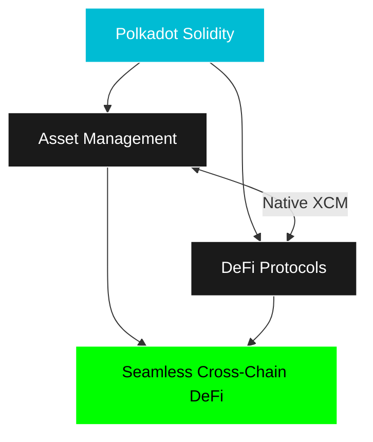
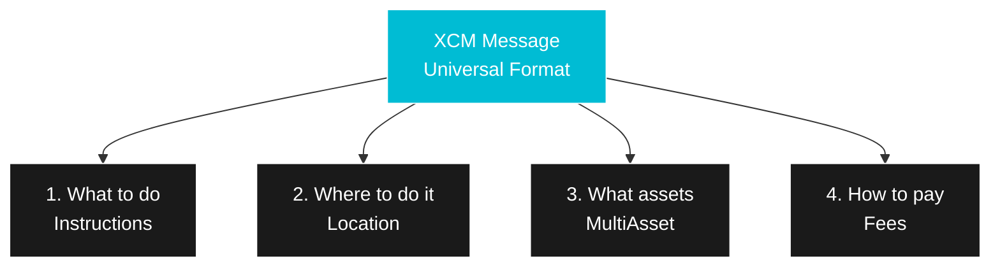

# Cross-chain DeFi Primitives

**XCM, Hyperbridge, and Building Cross-chain Applications**

**Presenter:** Tin

**Workshop Focus:** Understanding and implementing cross-chain DeFi functionality

---

## 📺 Workshop Recording

<iframe width="100%" height="600px" src="https://www.youtube.com/embed/WM0NCiC5GRM?si=UhSB6KMDnvdbx4CB" title="YouTube video player" frameborder="0" allow="accelerometer; autoplay; clipboard-write; encrypted-media; gyroscope; picture-in-picture; web-share" referrerpolicy="strict-origin-when-cross-origin" allowfullscreen></iframe>

---

## 🎯 Workshop Objectives

By the end of this workshop, you will:

- Understand XCM (Cross-Consensus Messaging)
- Learn Hyperbridge as a crypto-economic coprocessor
- Integrate the Hyperbridge ISMP SDK
- Build cross-chain DeFi applications
- Implement cross-chain asset transfers and storage queries
- Deploy a working cross-chain dApp

---

## The Cross-chain Vision

### Why Cross-chain?

**The Problem:**


**The Solution:**



### Benefits of True Interoperability

**For Users:**
✅ Access liquidity everywhere
✅ Best rates across chains
✅ Unified user experience
✅ No bridge risk

**For Developers:**
✅ Tap into entire ecosystem
✅ Compose with any protocol
✅ Network effects multiply
✅ Shared security

**For the Ecosystem:**
✅ Capital efficiency
✅ Innovation acceleration
✅ Competitive advantage
✅ Sustainable growth

---

## Understanding XCM

### What is XCM?

**XCM = Cross-Consensus Messaging Format**

Not a protocol, but a **language** for communicating between consensus systems.

**Key Concepts:**



**Characteristics:**

- Version-controlled (currently v3)
- Agnostic to transport layer
- Extensible instruction set
- Deterministic execution
- Built-in error handling

### XCM vs Traditional Bridges

**Traditional Bridge:**

```mermaid
graph TB
    SOURCE[Source Chain]
    BRIDGE[Bridge Contract<br/>Centralized]
    TARGET[Target Chain<br/>Wrapped Tokens]

    SOURCE -->|Lock Tokens| BRIDGE
    BRIDGE -->|Mint Wrapped| TARGET

    BRIDGE -.->|❌ Trust Required| RISK1[ ]
    BRIDGE -.->|❌ Security Risk| RISK2[ ]
    TARGET -.->|❌ Wrapped Tokens| RISK3[ ]
    TARGET -.->|❌ Fragmented Liquidity| RISK4[ ]

    style SOURCE fill:#ff0000,stroke:#fff,color:#fff
    style BRIDGE fill:#ff0000,stroke:#fff,color:#fff
    style TARGET fill:#ff0000,stroke:#fff,color:#fff
    style RISK1 fill:none,stroke:none
    style RISK2 fill:none,stroke:none
    style RISK3 fill:none,stroke:none
    style RISK4 fill:none,stroke:none
```



**XCM on Polkadot Solidity:**

```mermaid
graph TB
    HUB[Polkadot Solidity]
    RELAY[Relay Chain<br/>Validation]
    EXT[External Systems<br/>Native Assets]

    HUB -->|Native XCM| RELAY
    RELAY -->|Verified Message| EXT

    RELAY -.->|✅ Trustless| GOOD1[ ]
    EXT -.->|✅ Native Assets| GOOD2[ ]
    RELAY -.->|✅ Shared Security| GOOD3[ ]
    EXT -.->|✅ Unified Liquidity| GOOD4[ ]

    style HUB fill:#00BCD4,stroke:#fff,color:#fff
    style RELAY fill:#1a1a1a,stroke:#fff,color:#fff
    style EXT fill:#00ff00,stroke:#fff,color:#000
    style GOOD1 fill:none,stroke:none
    style GOOD2 fill:none,stroke:none
    style GOOD3 fill:none,stroke:none
    style GOOD4 fill:none,stroke:none
```



---

## XCM Architecture

### Core Components

**1. Locations (MultiLocation)**

How to address any location in the multiverse:

```rust
// Parent (Relay Chain)
MultiLocation {
    parents: 1,
    interior: Here
}

// Sibling parachain
MultiLocation {
    parents: 1,
    interior: X1(Parachain(2000))
}

// Account on parachain
MultiLocation {
    parents: 1,
    interior: X2(
        Parachain(2000),
        AccountId32 { id: [0x12, ...] }
    )
}
```

**2. Assets (MultiAsset)**

Universal way to represent assets:

```rust
MultiAsset {
    id: Concrete(MultiLocation {
        parents: 1,
        interior: Here  // Relay chain token
    }),
    fun: Fungible(1_000_000_000_000)  // 1 token
}
```

**3. Instructions**

What to do with the message:

- `TransferAsset`: Move assets
- `TransferReserveAsset`: Transfer with reserve
- `ReceiveTeleportedAsset`: Receive teleported assets
- `WithdrawAsset`: Take from holding
- `DepositAsset`: Put into account
- `BuyExecution`: Pay for execution
- And 30+ more instructions

---

## XCM Asset Transfer Models

### 1. Reserve Asset Transfer

**Most common for fungible tokens**

```
Parachain A (Origin Chain)
    ↓ Burn local representation
Relay Chain (Reserve Chain)
    ↓ Move asset in reserve
Parachain B (Destination)
    ↓ Mint local representation
```

**Example: Transfer DOT from A to B**

```rust
// On Parachain A
let message = Xcm(vec![
    WithdrawAsset(asset),           // Take from sender
    InitiateReserveWithdraw {       // Start reserve transfer
        assets: asset,
        reserve: Parent,             // Relay chain is reserve
        xcm: Xcm(vec![
            BuyExecution { ... },
            DepositAsset {           // Deposit to recipient
                assets: All,
                beneficiary: recipient
            }
        ])
    }
]);
```

### 2. Teleport

**For trusted chains only**

```
Source Chain
    ↓ Burn tokens
Destination Chain
    ↓ Mint tokens
```

**Use case:** Relay Chain ↔ System Parachains

```rust
let message = Xcm(vec![
    WithdrawAsset(asset),
    InitiateTeleport {
        assets: asset,
        dest: destination,
        xcm: Xcm(vec![
            BuyExecution { ... },
            DepositAsset { ... }
        ])
    }
]);
```

### 3. Remote Execution

**Execute instructions on another chain**

```rust
// Swap on remote DEX
let message = Xcm(vec![
    WithdrawAsset(asset),           // Pay for execution
    BuyExecution { ... },
    Transact {                      // Call smart contract
        origin_type: SovereignAccount,
        call: swap_call_data,       // DEX swap
    }
]);
```

---

## Implementing XCM in Smart Contracts

### Using Moonbeam's XCM Precompiles

**Moonbeam provides EVM precompiles for XCM:**

```solidity
// SPDX-License-Identifier: MIT
pragma solidity ^0.8.0;

// XCM Precompile interface
interface XCM {
    // Transfer assets to another parachain
    function transfer_assets_to_parachain(
        uint32 paraId,
        address beneficiary,
        address[] calldata assets,
        uint256[] calldata amounts,
        uint32 feeIndex
    ) external;

    // Execute remote call via XCM
    function remote_execute(
        uint32 paraId,
        bytes calldata call,
        uint64 transactRequiredWeightAtMost
    ) external;
}

contract CrossChainDApp {
    // XCM precompile address on Moonbeam
    XCM constant xcm = XCM(0x0000000000000000000000000000000000000804);

    // Send tokens to Acala
    function sendToAcala(
        address beneficiary,
        uint256 amount
    ) external {
        address[] memory assets = new address[](1);
        assets[0] = 0xFfFFfFff1FcaCBd218EDc0EbA20Fc2308C778080; // DOT

        uint256[] memory amounts = new uint256[](1);
        amounts[0] = amount;

        xcm.transfer_assets_to_parachain(
            2000,           // Acala parachain ID
            beneficiary,
            assets,
            amounts,
            0              // Fee asset index
        );
    }
}
```

### XCM with Polkadot.js

**JavaScript/TypeScript implementation:**

```typescript
import { ApiPromise, WsProvider } from "@polkadot/api";

async function sendXCM() {
  // Connect to parachain
  const api = await ApiPromise.create({
    provider: new WsProvider("wss://moonbeam.api.onfinality.io"),
  });

  // Define asset
  const asset = {
    id: {
      Concrete: {
        parents: 1,
        interior: "Here",
      },
    },
    fun: {
      Fungible: "1000000000000000000", // 1 token
    },
  };

  // Define destination
  const dest = {
    parents: 1,
    interior: {
      X1: {
        Parachain: 2000, // Target parachain
      },
    },
  };

  // Define beneficiary
  const beneficiary = {
    parents: 0,
    interior: {
      X1: {
        AccountId32: {
          id: "0x1234...",
          network: "Any",
        },
      },
    },
  };

  // Send XCM message
  const tx = api.tx.xTokens.transfer(asset, dest, beneficiary);

  await tx.signAndSend(sender);
}
```

---

## Hyperbridge: Crypto-Economic Coprocessor for Cross-chain Interoperability

### What is Hyperbridge?

**Hyperbridge is a crypto-economic coprocessor for secure interoperability:**

Secure interoperability requires verification of consensus proofs, state proofs, and state transition validity proofs. Traditional bridges use multi-sig committees, which have led to **$2 billion+ in losses**. Hyperbridge solves this with a coprocessor model.

**Core Innovation:**

- **Coprocessor Model**: Verification operations performed offchain, results reported onchain with cryptographic proofs
- **Proof Aggregation**: Verifies and aggregates finalized states of all chains into a single proof
- **Permissionless Relayers**: Powered by cryptographic proofs, no whitelisting or staking required
- **Chain-Agnostic**: Connect Polkadot, Ethereum, and any supported chain

**Architecture:**



```mermaid
graph TB
    HB[Hyperbridge Nexus<br/>Crypto-Economic Coprocessor]

    HB -->|Proof Aggregation| POL[Polkadot<br/>Parachains]
    HB -->|Proof Aggregation| ETH[Ethereum<br/>L1/L2s]
    HB -.->|Extensible| MORE[More Chains...]

    subgraph "ISMP Protocol"
        POST[POST Requests<br/>Send Messages]
        GET[GET Requests<br/>Read State]
    end

    POL <--> POST
    ETH <--> GET

    style HB fill:#00BCD4,stroke:#fff,color:#fff
    style POL fill:#1a1a1a,stroke:#fff,color:#fff
    style ETH fill:#1a1a1a,stroke:#fff,color:#fff
    style MORE fill:#1a1a1a,stroke:#00BCD4
    style POST fill:#1a1a1a,stroke:#00BCD4
    style GET fill:#1a1a1a,stroke:#00BCD4
```

### Hyperbridge vs XCM

**XCM:**
✅ Native to Polkadot
✅ Deep integration with parachains
✅ System-level messaging
❌ Limited to Polkadot ecosystem

**Hyperbridge (ISMP):**
✅ Chain-agnostic interoperability
✅ Connect to Ethereum, Cosmos, etc.
✅ Cryptographic proof verification
✅ Permissionless relayer network
✅ Cross-chain storage queries
❌ Requires relayer infrastructure

**Best Practice:** Use both!

- XCM for parachain-to-parachain communication
- Hyperbridge for external chain connectivity

---

## Hyperbridge SDK Integration

### Architecture Overview

Hyperbridge provides three SDK options:

1. **Solidity SDK** - For EVM smart contracts (POST/GET requests)
2. **Polkadot SDK** - For Substrate-based chains (ISMP module)
3. **Hyperbridge SDK** - TypeScript SDK for tracking requests

### Solidity SDK Installation

```bash
# Install via Foundry
forge install polytope-labs/hyperbridge

# Add remapping to foundry.toml
# @hyperbridge/=lib/hyperbridge/evm/
```

### Sending POST Requests (EVM)

```solidity
// SPDX-License-Identifier: MIT
pragma solidity ^0.8.0;

import "@hyperbridge/core/IDispatcher.sol";
import "@hyperbridge/core/StateMachine.sol";
import "@hyperbridge/core/HyperApp.sol";

contract CrossChainApp is HyperApp {
    constructor(address host) HyperApp(host) {}

    // Send a cross-chain message
    function sendCrossChainMessage(
        bytes memory destChain,
        bytes memory data,
        uint64 timeout,
        uint256 fee
    ) external payable {
        // Create POST request
        DispatchPost memory post = DispatchPost({
            dest: destChain,                    // e.g., StateMachine.ethereum()
            to: abi.encodePacked(targetContract),
            body: data,
            timeout: timeout,
            fee: fee,
            payer: msg.sender
});

        // Dispatch via Hyperbridge
        IDispatcher(host).dispatch{value: msg.value}(post);
    }
}
```

### Receiving Messages (EVM)

```solidity
// SPDX-License-Identifier: MIT
pragma solidity ^0.8.0;

import "@hyperbridge/core/IApp.sol";
import "@hyperbridge/core/HyperApp.sol";

contract MyDApp is HyperApp {
    constructor(address host) HyperApp(host) {}

    // Called when a POST request is received
    function onAccept(IncomingPostRequest calldata request)
        external
        override
        onlyHost
    {
        // Decode the message
        (address token, uint256 amount) = abi.decode(
            request.post.body,
            (address, uint256)
        );

        // Process the cross-chain message
        _handleMessage(request.post.source, token, amount);
    }

    // Called when a GET response is received
    function onGetResponse(IncomingGetResponse calldata response)
        external
        override
        onlyHost
    {
        // Process cross-chain storage query response
        _handleStorageResponse(response);
    }

    function _handleMessage(
        bytes memory source,
        address token,
        uint256 amount
    ) internal {
        // Your business logic here
    }
}
```

### Tracking Requests (TypeScript SDK)

```typescript
import { IndexerClient, EvmChain } from "@hyperbridge/sdk";

// Initialize the indexer client
const indexer = new IndexerClient({
  url: "https://indexer.hyperbridge.network",
});

// Track a POST request status
async function trackRequest(commitment: string) {
  const status = await indexer.postRequestStatus(commitment);

  console.log("Request status:", status);
  // Statuses: SOURCE_FINALIZED, HYPERBRIDGE_DELIVERED, DEST_FINALIZED
}

// Initialize chain connection
const evmChain = new EvmChain({
  host: "0x...", // IHost contract address
  rpcUrl: "https://rpc.api.moonbeam.network",
});
```

---

## Cross-chain DeFi Use Cases

### 1. Cross-chain DEX Aggregator

**Problem:** Best prices spread across multiple chains

**Solution:** Aggregate liquidity cross-chain

```solidity
contract CrossChainDEXAggregator {
    struct Quote {
        uint32 parachain;
        address dex;
        uint256 amountOut;
        bytes path;
    }

    // Get best quote across all chains
    function getBestQuote(
        address tokenIn,
        address tokenOut,
        uint256 amountIn
    ) external returns (Quote memory) {
        Quote memory best;

        // Check local DEXes
        best = _checkLocalDEXes(tokenIn, tokenOut, amountIn);

        // Check remote DEXes via XCM
        Quote[] memory remoteQuotes = _checkRemoteDEXes(
            tokenIn,
            tokenOut,
            amountIn
        );

        // Find best quote
        for (uint i = 0; i < remoteQuotes.length; i++) {
            if (remoteQuotes[i].amountOut > best.amountOut) {
                best = remoteQuotes[i];
            }
        }

        return best;
    }

    // Execute cross-chain swap
    function executeSwap(Quote memory quote) external {
        if (quote.parachain == 0) {
            // Local swap
            _executeLocalSwap(quote);
        } else {
            // Cross-chain swap via XCM
            _executeCrossChainSwap(quote);
        }
    }
}
```

### 2. Cross-chain Lending

**Deposit on one chain, borrow on another**

```solidity
contract CrossChainLending {
    // Track deposits across chains
    mapping(address => mapping(uint32 => uint256)) public deposits;

    // Deposit collateral on current chain
    function deposit(uint256 amount) external {
        token.transferFrom(msg.sender, address(this), amount);
        deposits[msg.sender][currentChainId()] += amount;

        // Notify other chains via XCM
        _broadcastDeposit(msg.sender, amount);
    }

    // Borrow on any chain (if sufficient collateral)
    function borrow(
        uint256 amount,
        uint32 targetChain
    ) external {
        uint256 totalCollateral = _getTotalCollateral(msg.sender);
        require(totalCollateral >= amount * 150 / 100, "Insufficient collateral");

        if (targetChain == currentChainId()) {
            // Local borrow
            _executeBorrow(msg.sender, amount);
        } else {
            // Cross-chain borrow via XCM
            _executeCrossChainBorrow(msg.sender, amount, targetChain);
        }
    }
}
```

### 3. Cross-chain Yield Aggregator

**Automatically move funds to best yields**

```solidity
contract YieldAggregator {
    struct Strategy {
        uint32 parachain;
        address protocol;
        uint256 apy;
        uint256 tvl;
        uint256 risk;
    }

    // Find best yield opportunity
    function findBestYield(
        address asset,
        uint256 amount
    ) public view returns (Strategy memory) {
        Strategy[] memory strategies = _getAllStrategies(asset);

        // Score each strategy (risk-adjusted return)
        uint256 bestScore = 0;
        Strategy memory best;

        for (uint i = 0; i < strategies.length; i++) {
            uint256 score = strategies[i].apy / strategies[i].risk;
            if (score > bestScore) {
                bestScore = score;
                best = strategies[i];
            }
        }

        return best;
    }

    // Deploy funds to best strategy
    function deployFunds(uint256 amount) external {
        Strategy memory best = findBestYield(baseAsset, amount);

        // Transfer asset and deploy
        if (best.parachain == currentChainId()) {
            _localDeploy(best, amount);
        } else {
            _crossChainDeploy(best, amount);
        }
    }
}
```

---

## Bifrost: Liquid Staking Use Case

### What is Bifrost?

**Bifrost provides liquid staking for Polkadot assets:**

**Key Features:**

- Stake DOT, get vDOT (liquid staking derivative)
- Use vDOT in DeFi while earning staking rewards
- Cross-chain integration via XCM
- 15-20% APY on staked assets

**Why It Matters:**

- Unlocks liquidity from staked assets
- Capital efficiency
- Enables DeFi composability
- Cross-chain yield strategies

### Integrating Bifrost

```solidity
// SPDX-License-Identifier: MIT
pragma solidity ^0.8.0;

interface IBifrost {
    function mint(uint256 amount) external returns (uint256);
    function redeem(uint256 vAmount) external returns (uint256);
    function exchangeRate() external view returns (uint256);
}

contract BifrostIntegration {
    IBifrost public bifrost;

    // Stake DOT and receive vDOT
    function stakeDOT(uint256 amount) external {
        // Transfer DOT from user
        dot.transferFrom(msg.sender, address(this), amount);

        // Approve Bifrost
        dot.approve(address(bifrost), amount);

        // Mint vDOT
        uint256 vAmount = bifrost.mint(amount);

        // Transfer vDOT to user
        vDOT.transfer(msg.sender, vAmount);
    }

    // Use vDOT in DeFi while earning staking rewards
    function depositVDOTToDeFi(uint256 vAmount) external {
        vDOT.transferFrom(msg.sender, address(this), vAmount);

        // vDOT can be used as collateral
        // Or provided as liquidity
        // Or lent out
        // All while earning staking rewards!
    }
}
```

### Cross-chain Bifrost Usage

```typescript
// Stake DOT on Polkadot, use vDOT on Moonbeam

// 1. Stake DOT on Bifrost parachain
const stakeTx = await bifrostApi.tx.vTokenMinting
  .mint({ Token: "DOT" }, amount)
  .signAndSend(account);

// 2. Transfer vDOT to Moonbeam via XCM
const transferTx = await bifrostApi.tx.xTokens
  .transfer(
    { Token: "vDOT" },
    amount,
    {
      parents: 1,
      interior: {
        X2: [
          { Parachain: 2004 }, // Moonbeam
          { AccountKey20: { key: evmAddress } },
        ],
      },
    },
    "Unlimited"
  )
  .signAndSend(account);

// 3. Use vDOT on Moonbeam DeFi protocols
// Now can trade, lend, or provide liquidity with vDOT
// While still earning DOT staking rewards!
```

---

## Building a Cross-chain DApp

### Project: Cross-chain Token Bridge

**Architecture:**

```
┌─────────────────┐         ┌─────────────────┐
│   Moonbeam      │         │   Astar         │
│  (Source Chain) │         │ (Dest Chain)    │
├─────────────────┤         ├─────────────────┤
│ Bridge Contract │──XCM──→ │ Bridge Contract │
│ - Lock tokens   │         │ - Mint tokens   │
│ - Emit event    │         │ - Track supply  │
└─────────────────┘         └─────────────────┘
```

**Source Chain Contract:**

```solidity
// SPDX-License-Identifier: MIT
pragma solidity ^0.8.0;

import "@openzeppelin/contracts/token/ERC20/IERC20.sol";

contract BridgeSource {
    IERC20 public token;
    uint32 public constant DEST_CHAIN = 2006; // Astar

    event TokensLocked(
        address indexed sender,
        uint256 amount,
        bytes32 indexed destAccount
    );

    constructor(address _token) {
        token = IERC20(_token);
    }

    function bridge(
        uint256 amount,
        bytes32 destAccount
    ) external {
        // Lock tokens on source chain
        token.transferFrom(msg.sender, address(this), amount);

        // Emit event for indexer
        emit TokensLocked(msg.sender, amount, destAccount);

        // Send XCM message to destination
        _sendXCM(amount, destAccount);
    }

    function _sendXCM(uint256 amount, bytes32 destAccount) internal {
        // Use XCM precompile
        XCM xcm = XCM(0x0000000000000000000000000000000000000804);

        // Encode mint call for destination
        bytes memory callData = abi.encodeWithSignature(
            "mintBridged(bytes32,uint256)",
            destAccount,
            amount
        );

        // Send XCM message
        xcm.remote_execute(
            DEST_CHAIN,
            callData,
            1000000000  // Weight
        );
    }
}
```

**Destination Chain Contract:**

```solidity
// SPDX-License-Identifier: MIT
pragma solidity ^0.8.0;

import "@openzeppelin/contracts/token/ERC20/ERC20.sol";

contract BridgeDestination is ERC20 {
    address public bridge;
    mapping(bytes32 => uint256) public bridged;

    event TokensMinted(
        bytes32 indexed account,
        uint256 amount
    );

    constructor() ERC20("Bridged Token", "bTKN") {
        bridge = msg.sender;
    }

    // Called via XCM from source chain
    function mintBridged(
        bytes32 account,
        uint256 amount
    ) external {
        require(msg.sender == bridge, "Unauthorized");

        // Mint bridged tokens
        address recipient = bytes32ToAddress(account);
        _mint(recipient, amount);

        bridged[account] += amount;

        emit TokensMinted(account, amount);
    }

    // Bridge back to source chain
    function bridgeBack(uint256 amount) external {
        // Burn tokens
        _burn(msg.sender, amount);

        // Send XCM message to unlock on source
        _sendUnlockMessage(msg.sender, amount);
    }

    function bytes32ToAddress(bytes32 b) internal pure returns (address) {
        return address(uint160(uint256(b)));
    }
}
```

### Frontend Integration

```typescript
import { ethers } from "ethers";
import { ApiPromise } from "@polkadot/api";

class CrossChainBridge {
  constructor(
    private sourceSigner: ethers.Signer,
    private destApi: ApiPromise
  ) {}

  async bridgeTokens(
    amount: ethers.BigNumber,
    destAccount: string
  ): Promise<string> {
    // Get bridge contract
    const bridge = new ethers.Contract(
      BRIDGE_ADDRESS,
      BRIDGE_ABI,
      this.sourceSigner
    );

    // Approve tokens
    const token = new ethers.Contract(
      TOKEN_ADDRESS,
      ERC20_ABI,
      this.sourceSigner
    );
    await token.approve(BRIDGE_ADDRESS, amount);

    // Bridge tokens
    const tx = await bridge.bridge(amount, destAccount);

    await tx.wait();

    // Monitor XCM message
    const messageId = await this.getXCMMessageId(tx);
    await this.waitForXCMDelivery(messageId);

    return tx.hash;
  }

  async waitForXCMDelivery(messageId: string): Promise<void> {
    // Monitor destination chain for message execution
    return new Promise((resolve) => {
      this.destApi.query.system.events((events) => {
        events.forEach((record) => {
          const { event } = record;

          if (event.section === "xcmpQueue" && event.method === "Success") {
            // XCM message executed successfully
            resolve();
          }
        });
      });
    });
  }
}
```

---

## Testing Cross-chain Functionality

### Local Testing with Chopsticks

**Chopsticks allows forking parachains:**

```bash
# Install Chopsticks
npm install -g @acala-network/chopsticks

# Fork Moonbeam
npx @acala-network/chopsticks \
  --endpoint wss://moonbeam.api.onfinality.io \
  --port 8000

# Fork Astar (in another terminal)
npx @acala-network/chopsticks \
  --endpoint wss://astar.api.onfinality.io \
  --port 8001
```

**Connect them with XCM:**

```yaml
# chopsticks-config.yml
- name: moonbeam
  endpoint: wss://moonbeam.api.onfinality.io
  port: 8000

- name: astar
  endpoint: wss://astar.api.onfinality.io
  port: 8001

# Enable XCM between them
xcm:
  - from: moonbeam
    to: astar
  - from: astar
    to: moonbeam
```

### Testing XCM Messages

```typescript
import { expect } from "chai";

describe("Cross-chain Bridge", () => {
  it("should bridge tokens from Moonbeam to Astar", async () => {
    // Setup
    const amount = ethers.parseEther("100");
    const destAccount = "0x742d35Cc6634C0532925a3b844Bc9e7595f0bEb";

    // Get initial balances
    const initialBalance = await sourceToken.balanceOf(user.address);

    // Bridge tokens
    await bridge.bridge(amount, destAccount);

    // Wait for XCM execution
    await waitForXCMExecution();

    // Check source chain
    expect(await sourceToken.balanceOf(user.address)).to.equal(
      initialBalance - amount
    );

    // Check destination chain
    const destBalance = await destToken.balanceOf(destAccount);
    expect(destBalance).to.equal(amount);
  });

  it("should handle failed XCM messages", async () => {
    // Test with insufficient gas
    await expect(
      bridge.bridge(amount, destAccount, { gasLimit: 100 })
    ).to.be.revertedWith("Insufficient gas");
  });
});
```

---

## Advanced Cross-chain Patterns

### 1. Atomic Cross-chain Swaps

**Swap assets across chains atomically:**

```solidity
contract AtomicCrossChainSwap {
    struct Swap {
        address initiator;
        address participant;
        uint256 amountA;
        uint256 amountB;
        uint32 chainB;
        bytes32 hashLock;
        uint256 timeLock;
        bool completed;
        bool refunded;
    }

    mapping(bytes32 => Swap) public swaps;

    // Initiate swap
    function initiate(
        address participant,
        uint256 amountA,
        uint256 amountB,
        uint32 chainB,
        bytes32 hashLock,
        uint256 duration
    ) external returns (bytes32) {
        bytes32 swapId = keccak256(abi.encodePacked(
            msg.sender,
            participant,
            block.timestamp
        ));

        swaps[swapId] = Swap({
            initiator: msg.sender,
            participant: participant,
            amountA: amountA,
            amountB: amountB,
            chainB: chainB,
            hashLock: hashLock,
            timeLock: block.timestamp + duration,
            completed: false,
            refunded: false
        });

        // Lock tokens
        token.transferFrom(msg.sender, address(this), amountA);

        // Notify other chain via XCM
        _notifyChainB(swapId, chainB);

        return swapId;
    }

    // Complete swap with secret
    function complete(bytes32 swapId, bytes32 secret) external {
        Swap storage swap = swaps[swapId];
        require(!swap.completed, "Already completed");
        require(block.timestamp < swap.timeLock, "Expired");
        require(
            keccak256(abi.encodePacked(secret)) == swap.hashLock,
            "Invalid secret"
        );

        swap.completed = true;

        // Release tokens to participant
        token.transfer(swap.participant, swap.amountA);

        // Use secret on other chain to claim
        _claimOnChainB(swapId, secret, swap.chainB);
    }
}
```

### 2. Cross-chain Governance

**Vote on one chain, execute on another:**

```solidity
contract CrossChainGovernance {
    struct Proposal {
        string description;
        uint32[] targetChains;
        bytes[] callDatas;
        uint256 forVotes;
        uint256 againstVotes;
        uint256 endTime;
        bool executed;
    }

    mapping(uint256 => Proposal) public proposals;
    uint256 public proposalCount;

    // Create proposal affecting multiple chains
    function propose(
        string memory description,
        uint32[] memory targetChains,
        bytes[] memory callDatas
    ) external returns (uint256) {
        uint256 proposalId = proposalCount++;

        proposals[proposalId] = Proposal({
            description: description,
            targetChains: targetChains,
            callDatas: callDatas,
            forVotes: 0,
            againstVotes: 0,
            endTime: block.timestamp + 7 days,
            executed: false
        });

        return proposalId;
    }

    // Execute passed proposal on all chains
    function execute(uint256 proposalId) external {
        Proposal storage proposal = proposals[proposalId];
        require(!proposal.executed, "Already executed");
        require(block.timestamp >= proposal.endTime, "Voting ongoing");
        require(proposal.forVotes > proposal.againstVotes, "Not passed");

        proposal.executed = true;

        // Execute on each target chain via XCM
        for (uint i = 0; i < proposal.targetChains.length; i++) {
            _executeOnChain(
                proposal.targetChains[i],
                proposal.callDatas[i]
            );
        }
    }
}
```

### 3. Cross-chain Flash Loans

**Borrow on one chain, use on another, repay atomically:**

```solidity
contract CrossChainFlashLoan {
    function flashLoan(
        uint256 amount,
        uint32 useOnChain,
        bytes calldata useCallData
    ) external {
        // Lend tokens
        token.transfer(msg.sender, amount);

        // Send XCM to execute on target chain
        _executeOnTargetChain(useOnChain, useCallData);

        // Verify repayment (with fee)
        uint256 fee = amount * 9 / 10000; // 0.09%
        require(
            token.balanceOf(address(this)) >= amount + fee,
            "Loan not repaid"
        );
    }
}
```

---

## Security Considerations

### XCM Security Best Practices

**1. Verify Message Source:**

```solidity
// Check XCM message origin
function onXCMReceived(
    uint32 sourceChain,
    bytes32 sourceAccount,
    bytes calldata data
) external {
    require(
        trustedChains[sourceChain],
        "Untrusted source chain"
    );
    require(
        sourceAccount == expectedAccount[sourceChain],
        "Untrusted source account"
    );

    _processMessage(data);
}
```

**2. Handle Failed Messages:**

```solidity
// Always have fallback for failed XCM
mapping(bytes32 => bool) public failedMessages;

function processXCM(bytes32 messageId, bytes calldata data) external {
    try this._executeXCM(data) {
        // Success
    } catch {
        // Mark as failed for retry
        failedMessages[messageId] = true;
    }
}

// Allow manual retry
function retryFailedMessage(bytes32 messageId, bytes calldata data) external {
    require(failedMessages[messageId], "Not failed");
    _executeXCM(data);
    delete failedMessages[messageId];
}
```

**3. Implement Timeouts:**

```solidity
struct PendingTransfer {
    uint256 amount;
    uint256 timestamp;
    bool completed;
}

mapping(bytes32 => PendingTransfer) public pending;

function initiateTransfer(uint256 amount) external returns (bytes32) {
    bytes32 transferId = keccak256(abi.encodePacked(msg.sender, block.timestamp));

    pending[transferId] = PendingTransfer({
        amount: amount,
        timestamp: block.timestamp,
        completed: false
    });

    // Send XCM
    _sendXCM(transferId, amount);

    return transferId;
}

// Refund if XCM fails
function refundIfFailed(bytes32 transferId) external {
    PendingTransfer storage t = pending[transferId];
    require(!t.completed, "Already completed");
    require(
        block.timestamp > t.timestamp + 1 hours,
        "Too soon"
    );

    // Refund user
    token.transfer(msg.sender, t.amount);
}
```

### Common Pitfalls

❌ **Not checking XCM execution result**
❌ **Assuming instant cross-chain execution**
❌ **Not handling chain reorganizations**
❌ **Ignoring XCM fees and weights**
❌ **No fallback for failed messages**

✅ **Always verify message source**
✅ **Implement timeouts and refunds**
✅ **Handle async execution**
✅ **Test extensively on testnet**
✅ **Monitor XCM message status**

---

## Hands-On Exercise

### Build a Cross-chain Portfolio Tracker

**Requirements:**

- Track assets across multiple parachains
- Aggregate total value
- Display yield opportunities
- Enable one-click rebalancing

**Steps:**

1. **Set up contracts on two chains:**

   - Moonbeam (main contract)
   - Astar (remote balance tracking)

2. **Implement XCM communication:**

   - Query balances cross-chain
   - Execute rebalancing

3. **Create frontend:**
   - Display multi-chain portfolio
   - Show best yields
   - Enable cross-chain actions

**Starter Code:**

```solidity
contract PortfolioTracker {
    struct Asset {
        address token;
        uint32 chain;
        uint256 balance;
        uint256 yield;
    }

    mapping(address => Asset[]) public portfolios;

    // Add asset from any chain
    function addAsset(
        address token,
        uint32 chain,
        uint256 balance
    ) external {
        // Query remote chain for actual balance
        if (chain != block.chainid) {
            _queryRemoteBalance(token, chain, msg.sender);
        }

        portfolios[msg.sender].push(Asset({
            token: token,
            chain: chain,
            balance: balance,
            yield: 0
        }));
    }

    // TODO: Implement _queryRemoteBalance
    // TODO: Implement getTotalValue
    // TODO: Implement rebalance
}
```

**Time: 60 minutes**

---

## Resources and Next Steps

### Documentation

**XCM:**

- XCM Format: https://github.com/paritytech/xcm-format
- XCM Docs: https://wiki.polkadot.network/docs/learn-xcm
- XCM Examples: https://github.com/paritytech/polkadot/tree/master/xcm

**Hyperbridge:**

- Hyperbridge Documentation: https://docs.hyperbridge.network
- Developer Guide: https://docs.hyperbridge.network/developers
- Solidity SDK: https://docs.hyperbridge.network/developers/evm/overview
- Polkadot SDK: https://docs.hyperbridge.network/developers/polkadot/getting-started
- TypeScript SDK: https://docs.hyperbridge.network/developers/sdk/overview
- GitHub Repository: https://github.com/polytope-labs/hyperbridge
- Protocol Specification: https://docs.hyperbridge.network/protocol

**Bifrost:**

- Bifrost Docs: https://docs.bifrost.finance
- Integration Guide: https://docs.bifrost.finance/integration
- SDK: https://github.com/bifrost-finance/bifrost.js

### Tools

**Development:**

- Chopsticks (testing): https://github.com/AcalaNetwork/chopsticks
- XCM Tools: https://github.com/paritytech/xcm-tools
- Moonbeam XCM Precompiles: https://docs.moonbeam.network/builders/xcm

**Monitoring:**

- Subscan XCM: https://www.subscan.io
- Polkaholic: https://polkaholic.io
- DotMarketCap: https://dotmarketcap.com

### Community

- Polkadot Discord (XCM channel)
- Moonbeam Discord
- Astar Discord
- Bifrost Telegram

---

## Q&A and Live Demo

### Common Questions

**Q: How long does an XCM message take?**
A: Typically 1-2 blocks on destination (12-24 seconds), but can vary.

**Q: What happens if XCM fails?**
A: Depends on implementation. Best practice: implement timeouts and refunds.

**Q: Can I use XCM from Ethereum?**
A: Not directly. Use Hyperbridge (ISMP protocol) to connect Ethereum to Polkadot with cryptographic proof verification.

**Q: Are XCM messages expensive?**
A: Relatively cheap (usually < $0.01), much less than traditional bridges.

**Q: How do I debug XCM issues?**
A: Check block explorers, use chopsticks for local testing, monitor events.

### Live Demo

**Let's build together:**

1. Deploy contracts on Moonbase and Shibuya
2. Send XCM message between chains
3. Track message execution
4. Handle success/failure cases

---

## Summary

### Key Takeaways

✅ **XCM enables trustless cross-chain communication within Polkadot**
✅ **Hyperbridge is a crypto-economic coprocessor for external chain connectivity**
✅ **ISMP protocol enables POST requests (messages) and GET requests (storage queries)**
✅ **Permissionless relayers powered by cryptographic proofs**
✅ **Cross-chain DeFi unlocks new possibilities**
✅ **Bifrost example shows real-world liquid staking usage**
✅ **Security and proper error handling are critical**

### Next Workshop

**"Walk through Polkadot Grant Ecosystem"**

Learn:

- How to apply for grants
- Writing winning proposals
- Grant requirements
- Success strategies

**See you there!**
