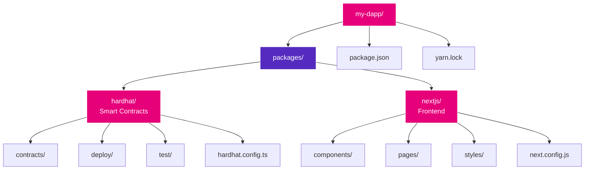
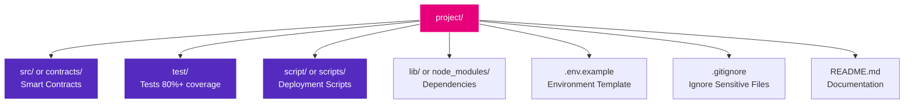

# EVM on Polkadot

**Toolings and Development Setup**

**Presenter:** Tin

**Workshop Focus:** Hands-on development environment setup and EVM deployment

---

## 📺 Workshop Recording

<iframe width="100%" height="600px" src="https://www.youtube.com/embed/9mqerlQXgMk?si=gkycaA8hhSI5aO8U" title="YouTube video player" frameborder="0" allow="accelerometer; autoplay; clipboard-write; encrypted-media; gyroscope; picture-in-picture; web-share" referrerpolicy="strict-origin-when-cross-origin" allowfullscreen></iframe>

---

## 🎯 Workshop Objectives

By the end of this workshop, you will:

- Understand dual VM architecture on Polkadot
- Set up complete development environment
- Configure DevContainer, Foundry, and Hardhat
- Deploy your first smart contract
- Use Scaffold DOT for rapid development

---

## Understanding Dual VM Architecture

### What is a Virtual Machine?

**Virtual Machine (VM):**

- Executes smart contract code
- Provides isolated environment
- Ensures deterministic execution
- Manages state and gas

**Traditional Blockchain:**


**Polkadot Hub Dual VM:**

```mermaid
graph TB
    subgraph HUB[Polkadot Hub on Asset Hub]
        PALLET[pallet-revive<br/>Shared Infrastructure]
        REVM[REVM<br/>EVM Compatible]
        POLKAVM[PolkaVM<br/>RISC-V]
    end

    RELAY[Polkadot Relay Chain]

    PALLET --> REVM
    PALLET --> POLKAVM
    HUB -.->|Secured by| RELAY

    style HUB fill:#262626,stroke:#E6007A,stroke-width:2px
    style PALLET fill:#1a1a1a,stroke:#E6007A
    style REVM fill:#E6007A,stroke:#fff,color:#fff
    style POLKAVM fill:#552BBF,stroke:#fff,color:#fff
    style RELAY fill:#E6007A,stroke:#fff,color:#fff
```



### Polkadot Hub's Dual VM Strategy

**REVM (Primary - Production Ready):**
✅ 100% EVM-compatible Rust implementation
✅ Powers Foundry and Reth (battle-tested)
✅ Launch: December 2025 on Polkadot Hub
✅ All Ethereum tooling works (Hardhat, Foundry, Remix)
✅ Deploy Solidity contracts unchanged

**PolkaVM (Future - Preview):**
✅ Register-based RISC-V architecture
✅ Multi-language support (not just Solidity)
✅ Launch: Preview alongside REVM in December 2025
✅ Optimized for Polkadot's cross-chain features
✅ Future innovation path

**Both VMs run through pallet-revive** - a unified smart contract framework

**Dual VM = Ethereum Compatibility Today + Polkadot Innovation Tomorrow**

---

## Polkadot Hub Network

### The Smart Contract Platform on Polkadot

**What is Polkadot Hub?**

- Smart contracts on Asset Hub (Polkadot's system parachain)
- Full Ethereum compatibility via REVM
- Production-ready platform launching December 2025
- Extensive tooling support

**Key Features:**

- 100% Ethereum RPC compatibility
- Solidity and Vyper support
- Web3.js and Ethers.js work unchanged
- MetaMask integration
- Hardhat and Foundry support
- Native XCM access for cross-chain operations
- Access to Asset Hub native runtime functions

**Network Details:**

```
Mainnet: Polkadot Hub (December 2025)
Testnet: Westend Hub (Available Now)
Chain ID: TBD
RPC: https://westend-hub.polkadot.io
Faucet: https://faucet.polkadot.io
```

### Why Polkadot Hub?

**Unique Advantages:**

- Zero deployment costs (no parachain slot needed)
- Asset Hub security (Polkadot system parachain)
- Built-in XCM for cross-chain operations
- Native Asset Hub runtime access from smart contracts
- Optimized for dApp development

---

## Development Environment Overview

### What We'll Set Up Today

```mermaid
graph TB
    START[Development Environment]

    START --> NODE[1. Node.js & npm/yarn]
    START --> VSCODE[2. VS Code + Extensions]
    START --> DOCKER[3. DevContainer Docker]
    START --> FOUNDRY[4. Foundry Tools]
    START --> HARDHAT[5. Hardhat Framework]
    START --> SCAFFOLD[6. Scaffold DOT]
    START --> WALLET[7. Wallet MetaMask]
    START --> RPC[8. RPC Configuration]

    style START fill:#E6007A,stroke:#fff,color:#fff
    style NODE fill:#1a1a1a,stroke:#E6007A
    style VSCODE fill:#1a1a1a,stroke:#E6007A
    style DOCKER fill:#1a1a1a,stroke:#E6007A
    style FOUNDRY fill:#1a1a1a,stroke:#E6007A
    style HARDHAT fill:#1a1a1a,stroke:#E6007A
    style SCAFFOLD fill:#1a1a1a,stroke:#E6007A
    style WALLET fill:#1a1a1a,stroke:#E6007A
    style RPC fill:#1a1a1a,stroke:#E6007A
```



### Prerequisites

**Required:**

- Computer with 8GB+ RAM
- 20GB+ free disk space
- Internet connection
- Basic command line knowledge

**Recommended:**

- 16GB+ RAM for smooth experience
- SSD storage
- Stable internet
- Some JavaScript/Solidity knowledge

---

## Part 1: Base System Setup

### Installing Node.js

**Using NVM (Recommended):**

```bash
# Install NVM
curl -o- https://raw.githubusercontent.com/nvm-sh/nvm/v0.39.0/install.sh | bash

# Restart terminal, then:
nvm install 18
nvm use 18
nvm alias default 18

# Verify
node --version  # Should show v18.x.x
npm --version   # Should show 9.x.x or higher
```

**Alternative: Direct Installation**

- Download from: https://nodejs.org
- Install LTS version (18.x or 20.x)
- Follow installer instructions

### Installing Yarn (Optional but Recommended)

```bash
npm install -g yarn

# Verify
yarn --version
```

### Installing Git

**macOS:**

```bash
# Using Homebrew
brew install git
```

**Linux:**

```bash
# Ubuntu/Debian
sudo apt-get update
sudo apt-get install git

# Fedora
sudo dnf install git
```

**Windows:**

- Download from: https://git-scm.com
- Run installer
- Use Git Bash for commands

---

## Part 2: VS Code Setup

### Installing VS Code

**Download and Install:**

- Visit: https://code.visualstudio.com
- Download for your OS
- Install and launch

### Essential Extensions

**Install These Extensions:**

```bash
# Launch VS Code
code .

# Install via command palette (Cmd/Ctrl + Shift + P)
```

**Required Extensions:**

1. **Solidity** by Juan Blanco

   - Syntax highlighting
   - Code completion
   - Linting

2. **Hardhat Solidity** by Nomic Foundation

   - Enhanced Solidity support
   - Hardhat integration

3. **Dev Containers** by Microsoft

   - DevContainer support
   - Docker integration

4. **ESLint**

   - JavaScript linting
   - Code quality

5. **Prettier**
   - Code formatting
   - Consistent style

**Recommended Extensions:**

- GitLens
- Thunder Client (API testing)
- Error Lens
- Path Intellisense

### VS Code Settings

**Create `.vscode/settings.json`:**

```json
{
  "solidity.compileUsingRemoteVersion": "v0.8.20",
  "solidity.formatter": "prettier",
  "editor.formatOnSave": true,
  "editor.defaultFormatter": "esbenp.prettier-vscode",
  "[solidity]": {
    "editor.defaultFormatter": "JuanBlanco.solidity"
  }
}
```

---

## Part 3: Docker and DevContainer

### Why DevContainer?

**Benefits:**

- Consistent environment across team
- No "works on my machine" issues
- Quick onboarding
- Isolated dependencies
- Version controlled configuration

### Installing Docker

**macOS:**

```bash
# Using Homebrew
brew install --cask docker

# Or download Docker Desktop from:
# https://www.docker.com/products/docker-desktop
```

**Linux:**

```bash
# Ubuntu/Debian
sudo apt-get update
sudo apt-get install docker.io docker-compose

# Start Docker
sudo systemctl start docker
sudo systemctl enable docker

# Add user to docker group
sudo usermod -aG docker $USER
# Log out and back in
```

**Windows:**

- Download Docker Desktop
- Enable WSL2 backend
- Follow installer

**Verify Installation:**

```bash
docker --version
docker-compose --version
```

### DevContainer Configuration

**Create `.devcontainer/devcontainer.json`:**

```json
{
  "name": "Polkadot EVM Dev",
  "image": "mcr.microsoft.com/devcontainers/typescript-node:18",
  "features": {
    "ghcr.io/devcontainers/features/rust:1": {
      "version": "latest"
    },
    "ghcr.io/devcontainers/features/docker-in-docker:2": {}
  },
  "customizations": {
    "vscode": {
      "extensions": [
        "JuanBlanco.solidity",
        "NomicFoundation.hardhat-solidity",
        "dbaeumer.vscode-eslint",
        "esbenp.prettier-vscode"
      ]
    }
  },
  "postCreateCommand": "npm install -g yarn && curl -L https://foundry.paradigm.xyz | bash",
  "forwardPorts": [3000, 8545],
  "remoteUser": "node"
}
```

**Using DevContainer:**

1. Open folder in VS Code
2. Cmd/Ctrl + Shift + P
3. "Dev Containers: Reopen in Container"
4. Wait for container to build
5. You're in isolated environment!

---

## Part 4: Foundry Setup

### What is Foundry?

**Foundry is a blazing fast Ethereum toolkit:**

**Components:**

- **Forge:** Testing framework
- **Cast:** RPC interaction tool
- **Anvil:** Local testnet
- **Chisel:** Solidity REPL

**Why Foundry?**
✅ Written in Rust (super fast)
✅ Test in Solidity (no context switching)
✅ Gas reports built-in
✅ Fuzz testing
✅ Best-in-class developer experience

### Installing Foundry

```bash
# Install Foundryup (installer)
curl -L https://foundry.paradigm.xyz | bash

# Restart terminal or source:
source ~/.bashrc  # or ~/.zshrc

# Install Foundry
foundryup

# Verify installation
forge --version
cast --version
anvil --version
chisel --version
```

### Creating a Foundry Project

```bash
# Create new project
forge init my-polkadot-project
cd my-polkadot-project

# Project structure:
# ├── src/          # Smart contracts
# ├── test/         # Tests
# ├── script/       # Deployment scripts
# ├── lib/          # Dependencies
# └── foundry.toml  # Configuration
```

### Foundry Configuration

**Edit `foundry.toml`:**

```toml
[profile.default]
src = "src"
out = "out"
libs = ["lib"]
solc_version = "0.8.20"

# RPC endpoints
[rpc_endpoints]
# Polkadot Hub Networks
polkadot_hub_testnet = "https://westend-hub.polkadot.io"
polkadot_hub_mainnet = "TBD"  # Coming December 2025

# For comparison/reference
ethereum_mainnet = "https://eth.llamarpc.com"
ethereum_sepolia = "https://rpc.sepolia.org"

# Verification API keys (when available)
[etherscan]
polkadot_hub = { key = "${POLKADOT_HUB_API_KEY}" }
```

### First Foundry Contract

**Create `src/Counter.sol`:**

```solidity
// SPDX-License-Identifier: MIT
pragma solidity ^0.8.20;

contract Counter {
    uint256 public number;

    function setNumber(uint256 newNumber) public {
        number = newNumber;
    }

    function increment() public {
        number++;
    }
}
```

**Create `test/Counter.t.sol`:**

```solidity
// SPDX-License-Identifier: MIT
pragma solidity ^0.8.20;

import "forge-std/Test.sol";
import "../src/Counter.sol";

contract CounterTest is Test {
    Counter public counter;

    function setUp() public {
        counter = new Counter();
        counter.setNumber(0);
    }

    function test_Increment() public {
        counter.increment();
        assertEq(counter.number(), 1);
    }

    function testFuzz_SetNumber(uint256 x) public {
        counter.setNumber(x);
        assertEq(counter.number(), x);
    }
}
```

**Run tests:**

```bash
# Run all tests
forge test

# Run with gas report
forge test --gas-report

# Run specific test
forge test --match-test test_Increment

# Run with verbosity
forge test -vvvv
```

---

## Part 5: Hardhat Setup

### What is Hardhat?

**Hardhat is a JavaScript development environment:**

**Features:**

- TypeScript support
- Flexible plugin system
- Built-in local network
- Console.log in Solidity
- Extensive ecosystem

**Why Use Hardhat?**
✅ JavaScript/TypeScript (familiar to web devs)
✅ Large plugin ecosystem
✅ Great debugging tools
✅ Extensive documentation
✅ Mainnet forking

### Installing Hardhat

```bash
# Create project directory
mkdir my-hardhat-project
cd my-hardhat-project

# Initialize npm project
npm init -y

# Install Hardhat
npm install --save-dev hardhat

# Create Hardhat project
npx hardhat init

# Select: "Create a TypeScript project"
# Install dependencies when prompted
```

### Hardhat Configuration

**Edit `hardhat.config.ts`:**

```typescript
import { HardhatUserConfig } from "hardhat/config";
import "@nomicfoundation/hardhat-toolbox";

const config: HardhatUserConfig = {
  solidity: "0.8.20",
  networks: {
    // Local development
    hardhat: {
      chainId: 1337,
    },

    // Polkadot Hub Testnet (Westend)
    polkadotHubTestnet: {
      url: "https://westend-hub.polkadot.io",
      chainId: 0, // TBD
      accounts: process.env.PRIVATE_KEY ? [process.env.PRIVATE_KEY] : [],
    },

    // Polkadot Hub Mainnet (Coming December 2025)
    polkadotHub: {
      url: "TBD",
      chainId: 0, // TBD
      accounts: process.env.PRIVATE_KEY ? [process.env.PRIVATE_KEY] : [],
    },
  },
  etherscan: {
    apiKey: {
      polkadotHub: process.env.POLKADOT_HUB_API_KEY || "",
    },
  },
};

export default config;
```

### Environment Variables

**Create `.env` file:**

```bash
# NEVER commit this file!
# Add .env to .gitignore

# Private key (without 0x prefix)
PRIVATE_KEY=your_private_key_here

# API keys for contract verification
MOONSCAN_API_KEY=your_moonscan_api_key
```

**Create `.env.example`:**

```bash
# Template for .env file
PRIVATE_KEY=
MOONSCAN_API_KEY=
```

**Load environment variables:**

```bash
# Install dotenv
npm install --save-dev dotenv

# Load in hardhat.config.ts
import "dotenv/config";
```

### First Hardhat Contract

**Create `contracts/Token.sol`:**

```solidity
// SPDX-License-Identifier: MIT
pragma solidity ^0.8.20;

import "@openzeppelin/contracts/token/ERC20/ERC20.sol";

contract Token is ERC20 {
    constructor(uint256 initialSupply) ERC20("MyToken", "MTK") {
        _mint(msg.sender, initialSupply);
    }
}
```

**Install OpenZeppelin:**

```bash
npm install @openzeppelin/contracts
```

**Compile:**

```bash
npx hardhat compile
```

### Hardhat Testing

**Create `test/Token.ts`:**

```typescript
import { expect } from "chai";
import { ethers } from "hardhat";
import { Token } from "../typechain-types";

describe("Token", function () {
  let token: Token;
  const initialSupply = ethers.parseEther("1000");

  beforeEach(async function () {
    const TokenFactory = await ethers.getContractFactory("Token");
    token = await TokenFactory.deploy(initialSupply);
    await token.waitForDeployment();
  });

  it("Should have correct initial supply", async function () {
    const [owner] = await ethers.getSigners();
    expect(await token.balanceOf(owner.address)).to.equal(initialSupply);
  });

  it("Should transfer tokens", async function () {
    const [owner, addr1] = await ethers.getSigners();
    const amount = ethers.parseEther("100");

    await token.transfer(addr1.address, amount);
    expect(await token.balanceOf(addr1.address)).to.equal(amount);
  });
});
```

**Run tests:**

```bash
npx hardhat test
```

### Deployment Script

**Create `scripts/deploy.ts`:**

```typescript
import { ethers } from "hardhat";

async function main() {
  const initialSupply = ethers.parseEther("1000000");

  console.log("Deploying Token contract...");

  const Token = await ethers.getContractFactory("Token");
  const token = await Token.deploy(initialSupply);

  await token.waitForDeployment();

  const address = await token.getAddress();
  console.log(`Token deployed to: ${address}`);
  console.log(`Initial supply: ${ethers.formatEther(initialSupply)} MTK`);

  // Wait for a few confirmations
  console.log("Waiting for confirmations...");
  await token.deploymentTransaction()?.wait(5);

  console.log("Deployment complete!");
}

main()
  .then(() => process.exit(0))
  .catch((error) => {
    console.error(error);
    process.exit(1);
  });
```

**Deploy:**

```bash
# Deploy to local network
npx hardhat run scripts/deploy.ts

# Deploy to Polkadot Hub Testnet
npx hardhat run scripts/deploy.ts --network polkadotHubTestnet

# Deploy to Polkadot Hub Mainnet (when available)
npx hardhat run scripts/deploy.ts --network polkadotHub
```

---

## Part 6: Scaffold DOT

### What is Scaffold DOT?

**Scaffold DOT is a full-stack dApp boilerplate:**

**Includes:**

- Pre-configured Next.js frontend
- Smart contract templates
- Hardhat backend
- Web3 wallet integration
- Component library
- Deployment scripts

**Perfect For:**

- Rapid prototyping
- Hackathons
- Learning
- Production apps

### Installing Scaffold DOT

```bash
# Using npx (recommended)
npx create-scaffold-dot my-dapp

# Or clone from GitHub
git clone https://github.com/scaffold-dot/scaffold-dot.git my-dapp
cd my-dapp

# Install dependencies
yarn install

# Or with npm
npm install
```

### Project Structure



### Running Scaffold DOT

**Terminal 1 - Start local blockchain:**

```bash
cd packages/hardhat
yarn chain
```

**Terminal 2 - Deploy contracts:**

```bash
cd packages/hardhat
yarn deploy
```

**Terminal 3 - Start frontend:**

```bash
cd packages/nextjs
yarn dev
```

**Open browser:**

- Frontend: http://localhost:3000
- Hardhat network: http://localhost:8545

### Customizing for Polkadot

**Edit `packages/hardhat/hardhat.config.ts`:**

```typescript
// Add Polkadot networks
moonbase: {
  url: "https://rpc.api.moonbase.moonbeam.network",
  chainId: 1287,
  accounts: [process.env.DEPLOYER_PRIVATE_KEY || ""],
},
astar: {
  url: "https://evm.astar.network",
  chainId: 592,
  accounts: [process.env.DEPLOYER_PRIVATE_KEY || ""],
},
```

**Update frontend `packages/nextjs/.env`:**

```bash
NEXT_PUBLIC_NETWORK=moonbase
NEXT_PUBLIC_ALCHEMY_API_KEY=your_key
```

---

## Part 7: Wallet Setup

### MetaMask Installation

**Install MetaMask:**

1. Visit: https://metamask.io
2. Download browser extension
3. Create wallet or import existing
4. **BACKUP YOUR SEED PHRASE!**

### Adding Polkadot Networks

**Moonbase Alpha (Testnet):**

```javascript
// Manual entry in MetaMask:
Network Name: Moonbase Alpha
RPC URL: https://rpc.api.moonbase.moonbeam.network
Chain ID: 1287
Currency Symbol: DEV
Block Explorer: https://moonbase.moonscan.io
```

**Moonbeam (Mainnet):**

```javascript
Network Name: Moonbeam
RPC URL: https://rpc.api.moonbeam.network
Chain ID: 1284
Currency Symbol: GLMR
Block Explorer: https://moonscan.io
```

**Shibuya (Astar Testnet):**

```javascript
Network Name: Shibuya
RPC URL: https://evm.shibuya.astar.network
Chain ID: 81
Currency Symbol: SBY
Block Explorer: https://shibuya.subscan.io
```

**Astar (Mainnet):**

```javascript
Network Name: Astar
RPC URL: https://evm.astar.network
Chain ID: 592
Currency Symbol: ASTR
Block Explorer: https://astar.subscan.io
```

### Getting Testnet Tokens

**Moonbase Alpha Faucet:**

- Visit: https://faucet.moonbeam.network
- Connect wallet
- Request DEV tokens
- Wait ~30 seconds

**Shibuya Faucet:**

- Visit: https://portal.astar.network
- Connect wallet
- Request SBY tokens

**Alternative: Discord Faucets**

```bash
# In respective Discord servers
!faucet your_address_here
```

---

## Part 8: Deploying Your First Contract

### Using Foundry

**1. Create contract (already done):**

```bash
# In your Foundry project
cd my-polkadot-project
```

**2. Deploy to Moonbase:**

```bash
# Set environment variables
export PRIVATE_KEY=your_private_key_here

# Deploy
forge create src/Counter.sol:Counter \
  --rpc-url moonbase \
  --private-key $PRIVATE_KEY

# You'll get contract address
# Deployed to: 0x...
```

**3. Interact with contract:**

```bash
# Set number
cast send 0xYourContractAddress \
  "setNumber(uint256)" 42 \
  --rpc-url moonbase \
  --private-key $PRIVATE_KEY

# Read number
cast call 0xYourContractAddress \
  "number()" \
  --rpc-url moonbase
```

### Using Hardhat

**1. Ensure network configured:**

Already done in `hardhat.config.ts`

**2. Deploy:**

```bash
# Deploy to Moonbase
npx hardhat run scripts/deploy.ts --network moonbase

# Output:
# Deploying Token contract...
# Token deployed to: 0x...
```

**3. Verify on Explorer:**

```bash
npx hardhat verify \
  --network moonbase \
  0xYourContractAddress \
  1000000000000000000000000
```

### Using Scaffold DOT

**1. Configure network:**

Edit `packages/hardhat/hardhat.config.ts` (already done)

**2. Deploy:**

```bash
cd packages/hardhat
yarn deploy --network moonbase
```

**3. Update frontend:**

Contract addresses automatically updated in `packages/nextjs/contracts/deployedContracts.ts`

**4. Connect frontend to network:**

Update MetaMask to Moonbase Alpha network
Refresh frontend
Contracts auto-detected

---

## Debugging and Troubleshooting

### Common Issues

**Issue: "Insufficient funds"**

```bash
# Solution: Get testnet tokens from faucet
# Visit faucet or use Discord bot
```

**Issue: "Nonce too high"**

```bash
# Solution: Reset MetaMask account
# Settings → Advanced → Reset Account
```

**Issue: "Contract deployment failed"**

```bash
# Check gas price:
cast gas-price --rpc-url moonbase

# Increase gas limit in deployment script:
const gas = await ethers.provider.getGasPrice();
await contract.deploy({ gasLimit: 3000000 });
```

**Issue: "RPC connection error"**

```bash
# Test RPC endpoint:
curl -X POST https://rpc.api.moonbase.moonbeam.network \
  -H "Content-Type: application/json" \
  -d '{"jsonrpc":"2.0","method":"eth_blockNumber","params":[],"id":1}'

# Try alternative RPC if needed
```

### Debugging Tools

**Foundry Debugger:**

```bash
# Debug failing test
forge test --debug testFunctionName
```

**Hardhat Console:**

```bash
npx hardhat console --network moonbase
```

**Cast for Quick Checks:**

```bash
# Get balance
cast balance 0xYourAddress --rpc-url moonbase

# Get block number
cast block-number --rpc-url moonbase

# Decode transaction
cast tx 0xTxHash --rpc-url moonbase
```

---

## Best Practices

### Code Organization



### Security Checklist

✅ **Never commit private keys**
✅ **Use .env for secrets**
✅ **Add .env to .gitignore**
✅ **Use hardware wallet for mainnet**
✅ **Test extensively on testnet**
✅ **Get security audit before mainnet**
✅ **Use recent Solidity version**
✅ **Import from trusted libraries (OpenZeppelin)**
✅ **Handle edge cases**
✅ **Emit events for important actions**

### Testing Best Practices

```solidity
// Write comprehensive tests
contract MyContractTest is Test {
    // Test happy path
    function test_NormalOperation() public {
        // ...
    }

    // Test edge cases
    function test_ZeroAmount() public {
        // ...
    }

    // Test failures
    function testFail_Unauthorized() public {
        // ...
    }

    // Fuzz testing
    function testFuzz_AnyAmount(uint256 amount) public {
        // ...
    }
}
```

### Gas Optimization

```solidity
// Use events instead of storage when possible
event DataStored(uint256 indexed id, bytes32 data);

// Pack variables
struct User {
    uint128 balance;  // Instead of uint256
    uint128 timestamp;
}

// Use immutable for constants set at deploy
address public immutable owner;

// Cache storage reads
uint256 temp = expensiveStorageVar;  // Single SLOAD
for (uint i = 0; i < temp; i++) {
    // Use temp instead
}
```

---

## Next Steps and Resources

### Practice Projects

**Beginner:**

1. Simple ERC20 token
2. Basic NFT contract
3. Counter with events
4. Simple storage contract

**Intermediate:** 5. ERC20 with features (mint, burn, pause) 6. NFT marketplace 7. Simple DAO 8. Staking contract

**Advanced:** 9. Cross-chain bridge 10. DEX (Uniswap V2 style) 11. Lending protocol 12. Options protocol

### Resources

**Documentation:**

- Foundry Book: https://book.getfoundry.sh
- Hardhat Docs: https://hardhat.org/docs
- Moonbeam Docs: https://docs.moonbeam.network
- Astar Docs: https://docs.astar.network

**Learning:**

- Polkadot Education Hub: https://learn.openguild.wtf
- Scaffold DOT Examples
- OpenZeppelin Contracts
- Solidity by Example

**Community:**

- Moonbeam Discord
- Astar Discord
- Foundry Telegram
- Hardhat Discord

---

## Hands-On Exercise

### Build a Simple Token Faucet

**Requirements:**

- Users can request tokens once per day
- 100 tokens per request
- Owner can fund faucet
- Track total distributed

**Contract Template:**

```solidity
// SPDX-License-Identifier: MIT
pragma solidity ^0.8.20;

import "@openzeppelin/contracts/token/ERC20/IERC20.sol";
import "@openzeppelin/contracts/access/Ownable.sol";

contract TokenFaucet is Ownable {
    IERC20 public token;
    uint256 public constant AMOUNT = 100 * 10**18;
    uint256 public constant COOLDOWN = 1 days;

    mapping(address => uint256) public lastRequest;

    event TokensRequested(address indexed user, uint256 amount);

    constructor(address _token) Ownable(msg.sender) {
        token = IERC20(_token);
    }

    function requestTokens() external {
        require(
            block.timestamp >= lastRequest[msg.sender] + COOLDOWN,
            "Too soon"
        );

        lastRequest[msg.sender] = block.timestamp;

        require(
            token.transfer(msg.sender, AMOUNT),
            "Transfer failed"
        );

        emit TokensRequested(msg.sender, AMOUNT);
    }

    function fundFaucet(uint256 amount) external onlyOwner {
        require(
            token.transferFrom(msg.sender, address(this), amount),
            "Transfer failed"
        );
    }
}
```

**Your Task:**

1. Deploy an ERC20 token
2. Deploy the faucet contract
3. Fund the faucet
4. Test requesting tokens
5. Create a simple frontend

**Time: 45 minutes**

---

## Q&A and Troubleshooting Session

### Common Questions

**Q: Which should I use, Foundry or Hardhat?**
A: Both! Foundry for testing (faster), Hardhat for complex deployments and mainnet forking.

**Q: How do I debug a reverted transaction?**
A: Use Hardhat's `console.log`, Foundry's `-vvvv` flag, or check block explorers for revert reason.

**Q: Can I use the same contract on Ethereum?**
A: Yes! EVM contracts are portable across all EVM chains.

**Q: How much do testnet deployments cost?**
A: Testnet tokens are free! Just need to pay gas with DEV/SBY tokens from faucets.

**Q: Should I verify my contracts?**
A: Yes! Always verify on block explorers. Makes your project trustworthy and easier to interact with.

### Live Coding Session

**Let's deploy together!**

- Share your screens
- Follow along
- Ask questions
- Debug together

---

## Summary and Next Workshop

### What We Covered

✅ Dual VM architecture
✅ EVM parachains (Moonbeam, Astar)
✅ Complete development environment
✅ Foundry setup and usage
✅ Hardhat configuration and deployment
✅ Scaffold DOT for rapid development
✅ Wallet configuration
✅ First contract deployment
✅ Debugging techniques
✅ Best practices

### Homework

Before next workshop:

1. **Complete environment setup**
2. **Deploy a simple contract**
3. **Try Scaffold DOT**
4. **Read XCM documentation**
5. **Join Moonbeam/Astar Discord**

### Next Workshop

**"Cross-chain DeFi Primitives"**

Topics:

- XCM deep dive
- Hyperbridge SDK
- Cross-chain asset transfers
- Building cross-chain dApps
- DeFi use cases with Bifrost

**See you there!**
