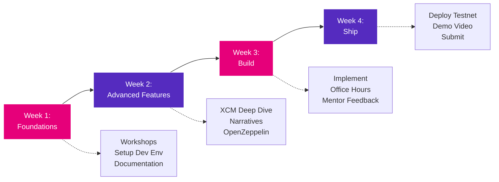

# Introduction to Polkadot Hub

Presenter: **Tin**

Welcome to the future of blockchain development on Polkadot

---

## 📺 Workshop Recording

<iframe width="100%" height="600px" src="https://www.youtube.com/embed/PqzUtLp2Oxc?si=3rE7C_R2cKQbCM0L" title="YouTube video player" frameborder="0" allow="accelerometer; autoplay; clipboard-write; encrypted-media; gyroscope; picture-in-picture; web-share" referrerpolicy="strict-origin-when-cross-origin" allowfullscreen></iframe>

---

## 🎯 What You'll Learn

By the end of this session, you'll understand:

- **The Vision**: Why smart contracts on Asset Hub changes everything
- **Architecture**: How REVM and PolkaVM enable EVM compatibility
- **Features**: XCM, privacy, and native Asset Hub runtime access
- **Timeline**: When Polkadot Hub launches and how to get involved
- **Resources**: Where to learn, build, and get support

**This is your entry point to building the next generation of cross-chain dApps**

---

## The Polkadot Hub Revolution

For the first time, **smart contracts are coming to Polkadot Asset Hub**

### What This Means

🚀 **Lower barriers to entry** - No parachain slot needed

⚡ **Full EVM compatibility** - Deploy Solidity contracts unchanged

🌉 **Native cross-chain** - XCM built-in, not bolted-on

🔐 **Asset Hub features** - Access native runtime functions from smart contracts

🎯 **December 2025** - Production launch on Polkadot Hub

**Asset Hub is becoming a complete smart contract platform with EVM compatibility**

---

## Why This Matters for Builders

### The Challenge Today

Building on Polkadot currently requires:

- Winning a parachain slot (expensive)
- Understanding Substrate (steep learning curve)
- Building validator infrastructure (complex)

### The Polkadot Hub Solution

```mermaid
graph LR
    ETH[Ethereum Developer] -->|Same Tools| HUB[Polkadot Hub]
    HUB -->|+ XCM| CROSS[Cross-Chain Apps]
    HUB -->|+ Security| RELAY[Relay Chain]
    HUB -->|+ Access| PARA[All Parachains]

    SOL[Solidity]-.->HUB
    TOOLS[Hardhat/Foundry]-.->HUB

    style ETH fill:#1a1a1a,stroke:#E6007A
    style HUB fill:#E6007A,stroke:#fff,color:#fff
    style CROSS fill:#552BBF,stroke:#fff,color:#fff
    style RELAY fill:#552BBF,stroke:#fff,color:#fff
    style PARA fill:#552BBF,stroke:#fff,color:#fff
```



Start building **immediately** with:

- **Solidity** you already know
- **Tools** you already use (Hardhat, Foundry, Remix)
- **Security** of Asset Hub (Polkadot system parachain)
- **Access** to all parachains via XCM
- **Native Asset Hub runtime** functionality from your contracts

**We're bringing Ethereum developers to Polkadot at scale**

---

## What is Polkadot Hub?

Polkadot Hub is a **smart contract execution environment** running on Polkadot Asset Hub, a system parachain.

### Three Pillars

**1. EVM Compatibility First**
100% compatible with Ethereum via REVM - deploy any Solidity contract

**2. Asset Hub Native Features**
XCM, native asset management, and direct access to Asset Hub runtime functions

**3. System Parachain Security**
Inherit the security of Polkadot through Asset Hub (a trusted system parachain)

**Think of it as: Ethereum's developer experience + Polkadot's cross-chain superpowers + Asset Hub's native capabilities**

---

## Polkadot Hub in the Ecosystem

### Where It Fits

```mermaid
graph TB
    subgraph RC[POLKADOT RELAY CHAIN]
        direction TB
        RELAY[Relay Chain<br/>Security & Consensus]
    end

    subgraph AH[ASSET HUB - System Parachain]
        HUB[Polkadot Hub<br/>Smart Contracts]
        ASSETS[Native Assets<br/>& Runtime]
    end

    RELAY -.->|Secures| AH
    HUB -->|Deploy| DAPPS[Your dApps]
    HUB -->|XCM| CROSS[Cross-Chain Apps]
    HUB -->|Native| DEFI[DeFi Protocols]
    HUB <-->|Access| ASSETS
    ASSETS -->|Runtime Functions| HUB

    style RC fill:#1a1a1a,stroke:#E6007A,stroke-width:3px
    style AH fill:#262626,stroke:#E6007A,stroke-width:3px
    style HUB fill:#E6007A,stroke:#fff,color:#fff
    style RELAY fill:#552BBF,stroke:#fff,color:#fff
    style ASSETS fill:#552BBF,stroke:#fff,color:#fff
    style DAPPS fill:#552BBF,stroke:#fff,color:#fff
    style CROSS fill:#552BBF,stroke:#fff,color:#fff
    style DEFI fill:#552BBF,stroke:#fff,color:#fff
```



**Hub**: Smart contracts on Asset Hub, Polkadot's system parachain
**Asset Hub Runtime**: Access native parachain functions from your smart contracts

---

## Why Polkadot Hub?

### The Ultimate Smart Contract Platform

| Feature            | Polkadot Hub Advantage                         |
| ------------------ | ---------------------------------------------- |
| **Location**       | Asset Hub - Polkadot's system parachain        |
| **Entry Cost**     | Zero - just deploy your contract               |
| **XCM Access**     | Built-in native cross-chain messaging          |
| **Security**       | Polkadot security through system parachain     |
| **Runtime Access** | Call native Asset Hub functions from contracts |
| **Launch Effort**  | Deploy & go - no infrastructure needed         |
| **Best For**       | dApps, DeFi, NFTs, and cross-chain apps        |

**Polkadot Hub**: The fastest way to build production-ready dApps on Polkadot

---

## Architecture: Dual VM Strategy

Polkadot Hub supports **two virtual machines** through a unified interface

### The Strategy

**REVM (Primary - Production)**

- 100% EVM-compatible Rust implementation
- Launch: December 2025
- Status: Production-ready

**PolkaVM (Future - Preview)**

- Register-based RISC-V architecture
- Launch: Preview alongside REVM
- Status: Experimental

**Why both?** Immediate EVM compatibility + future innovation

---

## Understanding REVM

**REVM** = Rust Ethereum Virtual Machine

### What Makes REVM Special

✅ **Battle-Tested**
Powers Foundry and Reth - proven in production

✅ **100% Compatible**
Every EVM opcode supported - deploy Ethereum contracts unchanged

✅ **High Performance**
Rust-optimized execution for faster, cheaper transactions

✅ **Actively Maintained**
Regular updates and security audits

**Bottom line**: If it runs on Ethereum, it runs on Polkadot Hub

---

## Understanding PolkaVM

**PolkaVM** = Polkadot's next-generation VM

### Why PolkaVM Exists

🚀 **Modern Architecture**
Register-based (like ARM/x86) vs stack-based (like EVM)

🔧 **Multi-Language**
Any language that compiles to RISC-V (not just Solidity)

⚡ **Optimized for Polkadot**
Native cross-chain operations and better weight mapping

### Current Status (2025)

- **Preview** release in December 2025
- Available for **testing** alongside REVM
- **Production** readiness timeline TBD

**For hackathons**: Focus on REVM; explore PolkaVM for fun

---

## Dual VM: Shared Infrastructure

Both VMs run through **pallet-revive** - a unified smart contract framework

### Architecture Stack

```mermaid
graph TB
    APP[Application Layer]

    subgraph DC[Developer Choice]
        REVM[REVM<br/>EVM Compatible]
        POLKAVM[PolkaVM<br/>RISC-V]
    end

    PALLET[pallet-revive<br/>Shared Stack]
    RELAY[Polkadot Relay Chain]

    APP --> REVM
    APP --> POLKAVM
    REVM --> PALLET
    POLKAVM --> PALLET
    PALLET --> RELAY

    style APP fill:#1a1a1a,stroke:#E6007A
    style DC fill:#262626,stroke:#552BBF,stroke-width:2px
    style REVM fill:#E6007A,stroke:#fff,color:#fff
    style POLKAVM fill:#552BBF,stroke:#fff,color:#fff
    style PALLET fill:#1a1a1a,stroke:#E6007A,stroke-width:2px
    style RELAY fill:#262626,stroke:#E6007A,stroke-width:3px
```



**Shared**: Storage, gas metering, precompiles, events
**Separate**: Execution environment

---

## Gas & Weights: The Economics

### Understanding the Model

**Ethereum Gas**

- Fixed units per operation
- Price fluctuates with demand

**Polkadot Weight**

- Based on actual execution time
- Measured in picoseconds

**Polkadot Hub Approach**

```
Solidity Contract
    ↓
REVM Execution (measured in gas)
    ↓
Converted to Polkadot Weights
    ↓
Fee in DOT
```

**Result**: Familiar gas model for developers, optimized execution on Polkadot

---

## Three Killer Features

Polkadot Hub launches with features **impossible** on Ethereum alone

### 1. XCM Precompiles

Call other parachains from Solidity contracts

### 2. Native Asset Hub Runtime Access

Call Asset Hub's native functions directly from smart contracts

### 3. Advanced Precompiles

Privacy via homomorphic encryption and account abstraction primitives

**These aren't add-ons - they're built into the platform**

---

## Feature 1: XCM Precompiles

**XCM** = Cross-Consensus Messaging (Polkadot's cross-chain protocol)

### What It Enables

🌉 **Parachain Communication**
Send messages and assets to any parachain from your contract

💱 **Cross-Chain DeFi**
Query prices, execute trades, move liquidity across chains

🎯 **Intent Execution**
Implement EIP-7683 cross-chain intents natively

### How It Works

Special precompile contracts at fixed addresses expose XCM functionality

```
Your Solidity Contract
    ↓
XCM Precompile (0x0...0800)
    ↓
Polkadot XCM Protocol
    ↓
Destination Parachain
```

**No bridges, no third parties, no additional trust assumptions**

---

## XCM Use Cases

### What Builders Are Creating

**Cross-Chain DEX Aggregator**
Find best prices across all parachain DEXes in one transaction

**Multi-Chain Yield Optimizer**
Deploy capital to highest APY automatically via XCM

**Unified DAO Treasury**
Govern assets across multiple parachains from one contract

**Cross-Chain NFT Marketplace**
List and trade NFTs from any parachain

**Payment Gateway**
Accept payments in any parachain's native token

**The possibilities are endless when chains can truly talk to each other**

---

## Feature 2: Native Asset Hub Runtime Access

**Direct access** to Asset Hub's native functions from your smart contracts

### Why This Matters

🎯 **Native Asset Management**
Create and manage assets using Asset Hub's battle-tested runtime

🔧 **Runtime Functions**
Call any Asset Hub pallet directly from Solidity

⚡ **Optimized Performance**
Native runtime calls are more efficient than smart contract logic

### How It Works

Runtime precompiles provide:

- **Direct pallet calls** from your contracts
- **Native asset creation** and management
- **Seamless integration** with existing Asset Hub features

**Access the full power of Asset Hub from EVM smart contracts**

---

## Runtime Access Use Cases

### Real-World Applications

**Native Asset Creation**
Create assets using Asset Hub's native functionality from your contract

**NFT Collections**
Leverage Asset Hub's NFT pallet directly from Solidity

**Cross-Contract Asset Management**
Manage complex asset operations through runtime calls

**Governance Integration**
Integrate with Asset Hub governance from your dApp

**Advanced Token Logic**
Combine EVM flexibility with native runtime efficiency

**Runtime access gives you the best of both worlds: EVM compatibility and native performance**

---

## Feature 3: Advanced Precompiles

**Enhanced functionality** through specialized precompile contracts

### What It Enables

🔐 **Privacy Precompiles**
Homomorphic encryption for confidential transfers (when available)

🔑 **Account Abstraction**
Smart accounts and gas sponsorship primitives

⚡ **Asset Hub Integration**
Direct access to native parachain functionality

### How It Works

Precompile contracts provide:

- Runtime function access at fixed addresses
- Optimized native operations
- Seamless EVM integration

**Bridge the gap between EVM and Substrate runtimes**

---

## Precompile Use Cases

### Powerful Integration Patterns

**Hybrid Contracts**
Combine EVM logic with native Asset Hub functions

**Efficient Asset Management**
Use native pallets for heavy operations, EVM for custom logic

**Cross-Chain Coordination**
XCM precompiles for seamless parachain communication

**Advanced User Accounts**
Account abstraction for better UX (when available)

**Optimized Performance**
Route expensive operations through native runtime

**Precompiles unlock capabilities impossible in pure EVM environments**

---

## Roadmap: The Journey to Launch

### Key Milestones

📅 **Q3 2025: Final Development**

- REVM integration complete
- Precompile implementations
- Security audits

📅 **Late October 2025: Kusama Hub**

- 100% EVM-compatible REVM on Kusama
- Public testnet for builders
- Real-world testing with KSM

📅 **Mid-December 2025: Polkadot Hub**

- **Production launch** on Polkadot Asset Hub
- REVM ready for mainnet dApps
- PolkaVM preview release

**Your hackathon projects can launch on production in December**

---

## What's Shipping December 2025

### Launch Features

✅ **REVM Production**
Full EVM compatibility, all Solidity contracts supported

✅ **XCM Precompiles**
Cross-chain messaging from smart contracts

✅ **Runtime Access Precompiles**
Direct access to Asset Hub native functions

✅ **Advanced Features**
Privacy and account abstraction primitives (roadmap)

✅ **Developer Tools**
Full Hardhat, Foundry, Remix support

✅ **Block Explorers**
Contract verification and debugging tools

**This is a complete platform, not a beta**

---

## Developer Resources

### Essential Starting Points

📖 **Official Documentation**

- [Polkadot Hub Docs](https://docs.polkadot.com/develop/smart-contracts/)
- [REVM Integration Details](https://forum.polkadot.network/t/smart-contracts-on-polkadot-hub-progress-update/14596)
- [XCM Precompiles Reference](https://docs.polkadot.com/develop/smart-contracts/precompiles/)

🛠️ **Development Tools**

- Hardhat / Foundry / Remix (standard Ethereum stack)
- Polkadot.js Apps for chain interaction
- Chopsticks for testing and forking

🤝 **OpenZeppelin Partnership**

- Verified contract libraries for Polkadot Hub
- [Forum Update](https://forum.polkadot.network/t/update-openzeppelin-support-for-polkadot-hub-refocusing-on-evm-first-deliverables/15780)
- Custom templates for XCM and privacy features

---

## Getting Started: Quick Setup

### Your Development Environment

**Option 1: Foundry (Recommended)**

```bash
curl -L https://foundry.paradigm.xyz | bash
foundryup
forge install OpenZeppelin/openzeppelin-contracts
```

**Option 2: Hardhat**

```bash
npm install --save-dev hardhat
npm install @openzeppelin/contracts
npx hardhat init
```

**Option 3: Remix IDE**
Browser-based, zero installation: https://remix.ethereum.org/

**All three work exactly as they do on Ethereum**

---

## Connecting to Polkadot Hub

### Network Configuration

**Local Development Node**

```bash
# Coming soon
docker run -p 9944:9944 parity/polkadot-hub --dev
```

**Westend Testnet (Available Now)**

- RPC: `https://westend-hub.polkadot.io`
- Chain ID: TBD
- Faucet: Discord bot or https://faucet.polkadot.io

**Polkadot Hub Mainnet (December 2025)**

- RPC: TBD
- Chain ID: TBD
- Gas Token: DOT

**Add to MetaMask like any EVM chain**

---

## First Steps for Builders

### Week 1 Checklist

✅ **Learn the Vision**

- Read [Polkadot Hub overview](https://polkadot.com/platform/hub/)
- Understand XCM basics
- Review OpenZeppelin updates

✅ **Set Up Tools**

- Install Foundry or Hardhat
- Connect to Westend testnet
- Get testnet tokens

✅ **Explore Examples**

- Deploy a simple ERC20
- Test OpenZeppelin contracts
- Join developer Discord

**Start building, start experimenting, start shipping**

---

## Learning Path for Hackathon

### Recommended Journey



**Week 1: Foundations**

- This workshop ✅
- "EVM Tooling and Development Setup"
- Polkadot Hub documentation

**Week 2: Advanced Features**

- "Cross-chain DeFi Primitives" (XCM deep dive)
- "Build on Polkadot: Narratives & Resources"
- OpenZeppelin integration guides

**Week 3: Build**

- Implement your project
- Attend office hours
- Get mentor feedback

**Week 4: Ship**

- Deploy to testnet
- Create demo video
- Submit to hackathon

---

## Project Ideas for Hackathon

### Cross-Chain Focus

**🌉 Cross-Chain DEX Aggregator**
Query liquidity across parachains, execute best-price trades

**💰 Multi-Chain Yield Optimizer**
Deploy capital to highest APY, auto-compound via XCM

**🏛️ DAO Treasury Manager**
Unified governance for multi-chain treasuries

**🎮 Cross-Chain Gaming Economy**
NFTs and tokens that work across multiple parachains

**💸 Payment Gateway**
Accept any parachain's token, settle in your preferred currency

**Focus on what's only possible with XCM**

---

## Project Ideas: Asset Hub Integration & UX

### Asset Hub Integration

**🎯 Native Asset Manager**
Leverage Asset Hub's asset creation with custom EVM logic

**🏦 Hybrid DeFi Protocol**
Use native runtime for efficiency, EVM for flexibility

**🏢 Advanced NFT Platform**
Combine Asset Hub NFT pallet with custom marketplace logic

### User Experience

**👛 Smart Contract Wallet**
Social recovery, gas sponsorship, session keys

**🎯 Onboarding Flow**
Email login + sponsored first 10 transactions

**🎮 Gaming Wallet**
Session keys for seamless gameplay

**Think: What can you build that leverages both EVM and Asset Hub native features?**

---

## Hackathon Success Tips

### What Judges Look For

**1. Innovation** (25 points)
Use Polkadot Hub features in novel ways

**2. Technical Quality** (25 points)
Clean code, good architecture, security-conscious

**3. Polkadot Integration** (20 points)
XCM, Asset Hub runtime access, or advanced precompiles (bonus for multiple!)

**4. Completeness** (15 points)
Working demo, documentation, polish

**5. Impact** (10 points)
Solves real problems, has market potential

**6. Presentation** (5 points)
Clear communication, good demo

**Don't just build on Polkadot Hub - build something that showcases why it's different**

---

## Community & Support

### Where to Get Help

💬 **Discord Community**

- #polkadot-hub-general
- #polkadot-hub-dev-support
- #hackathon (when events are live)
- Daily office hours during hackathons

📖 **Forum & Documentation**

- Polkadot Forum: https://forum.polkadot.network/
- Technical discussions and proposals
- Search "Polkadot Hub" for latest updates

🎓 **Educational Resources**

- Polkadot Wiki: https://wiki.polkadot.network/
- Polkadot Education Hub: https://learn.openguild.wtf/
- Polkadot Blockchain Academy content

**The community wants you to succeed - ask questions!**

---

## OpenZeppelin Partnership

### What It Means for Builders

**Verified Libraries**
All OpenZeppelin contracts tested and validated for Polkadot Hub

**Custom Templates**
Ready-made contracts for:

- XCM-enabled tokens
- Privacy-preserving contracts
- Smart account implementations

**Continuous Testing**
Automated CI/CD ensures compatibility stays perfect

**Contracts Wizard**
Generate Polkadot Hub contracts at https://wizard.openzeppelin.com

**You're building on a battle-tested foundation**

---

## Next Workshops in This Series

### Continue Your Learning

**🛠️ "EVM Tooling and Development Setup"**
Deep dive into Hardhat, Foundry, and deployment workflows

**🌉 "Cross-chain DeFi Primitives"**
Master XCM, build cross-chain applications

**💰 "Build on Polkadot: Narratives & Resources"**
Understand ecosystem, find funding, grow your project

**📝 "Polkadot Grant Ecosystem"**
How to get funded by Web3 Foundation and Treasury

**Check hackathon schedule for times**

---

## Submission Requirements

### What You Need to Submit

**1. Code Repository**

- Public GitHub repo
- Clear README with setup instructions
- Contract addresses on testnet
- MIT or Apache 2.0 license

**2. Demo Video (2-3 minutes)**

- Problem and solution
- Live demo of key features
- Technical highlights
- Polkadot Hub features used

**3. Presentation**

- Architecture overview
- Why Polkadot Hub specifically
- Future roadmap

**Ship it, even if it's not perfect - judges value learning and effort**

---

## Key Dates for Hackathon

### Timeline

**Week 1: Learn & Plan**

- Attend workshops
- Form teams
- Submit project proposal

**Week 2-3: Build**

- Core development
- Mid-point check-ins
- Mentor sessions

**Week 4: Polish & Ship**

- Deploy to Westend testnet
- Create demo video
- Final submission

**Post-Hackathon**

- December 2025: Deploy to Polkadot Hub mainnet
- Apply for grants to continue building
- Join the ecosystem!

---

## Why Build on Polkadot Hub?

### The Strategic Advantage

**🎯 First-Mover Advantage**
Be early in a major new platform

**🌐 Access to Polkadot Ecosystem**
Tap into billions in TVL across parachains

**🔒 Best-in-Class Security**
Polkadot security through Asset Hub system parachain

**🚀 Future-Proof Stack**
EVM today, PolkaVM tomorrow, both supported

**💰 Funding Opportunities**
Web3 Foundation grants, Treasury proposals, VC interest

**🤝 Growing Community**
Join a movement, not just a platform

---

## Common Questions

### Quick Answers

**Q: Do I need to know Rust?**
No - use Solidity, Hardhat/Foundry, just like Ethereum

**Q: Can I deploy existing contracts?**
Yes - 100% EVM compatibility means copy-paste works

**Q: What about gas costs?**
DOT for gas, prices TBD but designed to be competitive

**Q: Is it production-ready?**
December 2025 - yes! Until then, build on testnet

**Q: Can I use MetaMask?**
Yes - Polkadot Hub works with all EVM wallets

---

## Three Key Takeaways

### Remember This

**1. Polkadot Hub = EVM + Asset Hub + Superpowers**
Everything from Ethereum, plus XCM and native Asset Hub runtime access

**2. Build Now, Ship December**
Start developing today on testnet, launch on mainnet Q4 2025

**3. Cross-Chain is the Killer Feature**
Focus on what's only possible with XCM

**The question isn't "why Polkadot Hub?" - it's "why wouldn't you build here?"**

---

## Your Action Items

### This Week

**Today:**

- Set up Foundry or Hardhat
- Connect to Westend testnet
- Deploy a test contract

**This Week:**

- Join Discord community
- Attend next workshop in series
- Form or join a team
- Brainstorm project ideas

**This Month:**

- Build MVP of your project
- Get mentor feedback
- Submit to hackathon

**This Year:**

- Launch on Polkadot Hub mainnet in December
- Apply for grants
- Become part of the ecosystem

---

## Additional Resources

### Deep Dive Materials

**📖 Technical Docs**

- [Smart Contracts Overview](https://docs.polkadot.com/develop/smart-contracts/)
- [REVM Progress Update](https://forum.polkadot.network/t/smart-contracts-on-polkadot-hub-progress-update/14596)
- [EVM-First Strategy](https://forum.polkadot.network/t/update-openzeppelin-support-for-polkadot-hub-refocusing-on-evm-first-deliverables/15780)

**🎥 Video Content**

- Polkadot Blockchain Academy lectures
- Substrate seminars on YouTube
- Workshop recordings (coming soon)

**💻 Code Examples**

- OpenZeppelin Polkadot templates (coming soon)
- Community examples on GitHub
- Polkadot Hub documentation

---

## Join the Movement

### We're Building the Future Together

**Polkadot Hub isn't just a platform - it's a paradigm shift**

✨ Smart contracts on Asset Hub with native runtime access
✨ True cross-chain composability via XCM
✨ EVM compatibility meets Substrate power
✨ Ethereum developer experience + Polkadot innovation

**The tools are ready**
**The community is waiting**
**The opportunity is now**

### Let's Build Together

**See you in Discord, see you at the next workshop, see you on mainnet**

---

## Thank You! 🙏

### Stay Connected

**🔗 Links**

- Discord: https://polkadot.network/
- Forum: https://forum.polkadot.network/
- Twitter: @Polkadot
- Education Hub: https://learn.openguild.wtf/

**📧 Contact**

- Workshop questions: Discord #general
- Technical support: #dev-support
- Mentorship: Office hours (check schedule)

**🚀 Next Steps**

1. Install tools
2. Join Discord
3. Attend next workshop
4. Start building

**Happy hacking! 🛠️**
