# Polkadot Grant Ecosystem

**Writing Winning Proposals and Accessing Funding**

**Presenter:** Tin

**Workshop Focus:** Understanding grants, writing proposals, and securing funding

---

## 📺 Workshop Recording

<iframe width="100%" height="600px" src="https://www.youtube.com/embed/lSN72TE6uw0?si=_hoBdDY30RPpVjyX" title="YouTube video player" frameborder="0" allow="accelerometer; autoplay; clipboard-write; encrypted-media; gyroscope; picture-in-picture; web-share" referrerpolicy="strict-origin-when-cross-origin" allowfullscreen></iframe>

---

## 🎯 Workshop Objectives

By the end of this workshop, you will:

- Understand the Polkadot funding landscape
- Know different grant programs and their requirements
- Learn to write compelling proposals
- Analyze good vs bad proposals
- Master tips and tricks for success
- Understand the application and review process

---

## The Polkadot Funding Landscape

### Overview

**Multiple Funding Sources:**


### Funding by Stage

**Idea Stage:**

- Hackathons ($1k-$10k)
- Level 1 Grants ($10k)

**Building Stage:**

- Level 2 Grants ($30k)
- Community Grants ($10k-$50k)

**Growth Stage:**

- Level 3 Grants ($30k-$100k+)
- Treasury Proposals ($50k-$500k+)

**Scale Stage:**

- Polkadot Solidity Deployment
- VC Funding
- Revenue generation

---

## Web3 Foundation Grants

### Grant Levels Overview

```mermaid
graph TB
    subgraph LEVEL1["Level 1: Up to $10,000"]
        L1TIME[⏱️ 2-4 weeks approval]
        L1REQ[📋 Minimal requirements]
        L1TEAM[👤 Individual OK]
        L1FOCUS[🎯 Proof of Concept]

        L1TIME --> L1EXAMPLES
        L1REQ --> L1EXAMPLES
        L1TEAM --> L1EXAMPLES
        L1FOCUS --> L1EXAMPLES

        L1EXAMPLES[Examples:<br/>- Substrate pallet<br/>- Tutorial series<br/>- Developer tools<br/>- Documentation]
    end

    subgraph LEVEL2["Level 2: Up to $30,000"]
        L2TIME[⏱️ 4-8 weeks approval]
        L2REQ[📋 Detailed requirements]
        L2TEAM[👥 Team recommended]
        L2FOCUS[🎯 Feature-complete]

        L2TIME --> L2EXAMPLES
        L2REQ --> L2EXAMPLES
        L2TEAM --> L2EXAMPLES
        L2FOCUS --> L2EXAMPLES

        L2EXAMPLES[Examples:<br/>- Full dApp with UI<br/>- Substrate chain<br/>- Infrastructure service<br/>- Complex integration]
    end

    subgraph LEVEL3["Level 3: $30,000+"]
        L3TIME[⏱️ 8-12 weeks approval]
        L3REQ[📋 Comprehensive docs]
        L3TEAM[👥👥 Established team]
        L3FOCUS[🎯 Production-ready]

        L3TIME --> L3EXAMPLES
        L3REQ --> L3EXAMPLES
        L3TEAM --> L3EXAMPLES
        L3FOCUS --> L3EXAMPLES

        L3EXAMPLES[Examples:<br/>- Parachain development<br/>- Major protocol upgrade<br/>- Large infrastructure<br/>- Ecosystem-wide tool]
    end

    style LEVEL1 fill:#00BCD4,stroke:#fff,color:#fff
    style LEVEL2 fill:#1a1a1a,stroke:#fff,color:#fff
    style LEVEL3 fill:#00B2FF,stroke:#fff,color:#fff
    style L1EXAMPLES fill:#1a1a1a,stroke:#00BCD4,color:#fff
    style L2EXAMPLES fill:#1a1a1a,stroke:#1a1a1a,color:#fff
    style L3EXAMPLES fill:#1a1a1a,stroke:#00B2FF,color:#fff
```



### Progression Path

```mermaid
graph LR
    START[🚀 New Developer] --> L1[Level 1<br/>$10k]
    L1 --> SUCCESS1{Successful<br/>Delivery?}
    SUCCESS1 -->|Yes| L2[Level 2<br/>$30k]
    SUCCESS1 -->|No| IMPROVE1[Improve &<br/>Learn]
    IMPROVE1 --> L1

    L2 --> SUCCESS2{Successful<br/>Delivery?}
    SUCCESS2 -->|Yes| L3[Level 3<br/>$30k+]
    SUCCESS2 -->|No| IMPROVE2[Improve &<br/>Learn]
    IMPROVE2 --> L2

    L3 --> TREASURY[Treasury<br/>Proposals<br/>$50k-$500k+]
    TREASURY --> ECOSYSTEM[Ecosystem<br/>Contributor]

    style START fill:#00BCD4,stroke:#fff,color:#fff
    style L1 fill:#1a1a1a,stroke:#fff,color:#fff
    style L2 fill:#00B2FF,stroke:#fff,color:#fff
    style L3 fill:#00BCD4,stroke:#fff,color:#fff
    style TREASURY fill:#1a1a1a,stroke:#fff,color:#fff
    style ECOSYSTEM fill:#00ff00,stroke:#fff,color:#000
```



---

### Level 1: Up to $10,000

**Perfect Starting Point for New Teams**

```mermaid
graph LR
    IDEA[💡 Your Idea] --> CHECK{Fits Level 1?}
    CHECK -->|Yes| APPLY[📝 Apply]
    CHECK -->|No| REFINE[🔄 Refine Scope]
    REFINE --> CHECK

    APPLY --> REVIEW[👀 2-4 Week Review]
    REVIEW --> DECISION{Approved?}
    DECISION -->|Yes| BUILD[🔨 Build]
    DECISION -->|No| FEEDBACK[📋 Get Feedback]
    FEEDBACK --> REFINE

    BUILD --> DELIVER[✅ Deliver]
    DELIVER --> REPUTATION[⭐ Build Reputation]
    REPUTATION --> NEXT[➡️ Level 2]

    style IDEA fill:#00BCD4,stroke:#fff,color:#fff
    style APPLY fill:#1a1a1a,stroke:#fff,color:#fff
    style BUILD fill:#00B2FF,stroke:#fff,color:#fff
    style DELIVER fill:#00ff00,stroke:#fff,color:#000
```



**Characteristics:**

- ⏱️ Fast approval (2-4 weeks)
- 📋 Minimal requirements
- 👤 Perfect for individuals
- 🎯 Proof of concept focus
- 🏢 No legal entity needed
- 💬 No interview required

**Ideal For:**

- Research projects
- Prototypes & MVPs
- Developer tools
- Educational content
- Small improvements
- First-time applicants

**Real Example Projects:**

1. **Substrate Pallet for On-Chain Identity**

   - Funding: $8,500
   - Duration: 8 weeks
   - Team: 1 developer
   - Outcome: Successfully delivered, now used in 3 parachains

2. **Developer Tutorial Series: "Build Your First Parachain"**

   - Funding: $9,000
   - Duration: 6 weeks
   - Team: 1 technical writer + 1 reviewer
   - Outcome: 10,000+ developers completed

3. **Polkadot.js Helper Library**
   - Funding: $7,500
   - Duration: 10 weeks
   - Team: 2 developers
   - Outcome: 500+ weekly downloads on npm

---

### Level 2: Up to $30,000

**For Proven Teams with Bigger Vision**

```mermaid
graph TB
    TRACK[Previous Success<br/>or Strong Team] --> SCOPE[Larger Scope<br/>Project]

    SCOPE --> PREP[Preparation Phase]

    subgraph PREP[Preparation: 2-3 weeks]
        PROTO[Build Prototype]
        TEAM[Assemble Team]
        DOCS[Detailed Docs]
        PROTO --> TEAM --> DOCS
    end

    PREP --> SUBMIT[Submit Application]
    SUBMIT --> REVIEW[Committee Review<br/>4-8 weeks]

    REVIEW --> INTERVIEW{Interview<br/>Required?}
    INTERVIEW -->|Yes| TALK[Team Interview]
    INTERVIEW -->|No| DECISION
    TALK --> DECISION{Approved?}

    DECISION -->|Yes| MILESTONE[Milestone-based<br/>Delivery]
    DECISION -->|No| REVISE[Revise & Resubmit]

    MILESTONE --> M1[Milestone 1]
    M1 --> M2[Milestone 2]
    M2 --> M3[Milestone 3]
    M3 --> COMPLETE[✅ Complete]

    style TRACK fill:#00BCD4,stroke:#fff,color:#fff
    style SUBMIT fill:#1a1a1a,stroke:#fff,color:#fff
    style MILESTONE fill:#00B2FF,stroke:#fff,color:#fff
    style COMPLETE fill:#00ff00,stroke:#fff,color:#000
```



**Characteristics:**

- ⏱️ Longer review (4-8 weeks)
- 📋 More detailed requirements
- 🔄 Working prototype preferred
- 👥 Team recommended (2-3 people)
- 💬 Sometimes requires interview
- 📊 Milestone-based payments

**Ideal For:**

- Feature-complete applications
- Substantial improvements
- Complex developer tools
- Multi-phase projects
- Team projects with clear roles

**Real Example Projects:**

1. **Cross-Chain DEX with XCM Integration**

   - Funding: $28,000
   - Duration: 16 weeks (3 milestones)
   - Team: 3 developers + 1 designer
   - Milestones: Core protocol → XCM integration → Frontend
   - Outcome: Live on 2 parachains, $5M TVL

2. **Substrate Testing Framework**

   - Funding: $25,000
   - Duration: 12 weeks
   - Team: 2 senior developers
   - Outcome: Adopted by 15+ parachain teams

3. **Parachain Block Explorer**
   - Funding: $30,000
   - Duration: 20 weeks
   - Team: 2 backend + 1 frontend developer
   - Outcome: Processing 100k+ transactions daily

---

### Level 3: $30,000+

**Major Infrastructure & Innovation**

```mermaid
graph TB
    ESTABLISH[Established Team<br/>+ Track Record] --> MAJOR[Major Project Scope]

    MAJOR --> PLANNING[Extensive Planning]

    subgraph PLANNING[Planning Phase: 3-4 weeks]
        ARCH[Architecture Design]
        RESEARCH[Research & Analysis]
        BUDGET[Detailed Budget]
        RISK[Risk Assessment]
        ARCH --> RESEARCH --> BUDGET --> RISK
    end

    PLANNING --> APP[Comprehensive<br/>Application]
    APP --> INIT[Initial Review<br/>2-3 weeks]
    INIT --> TECH[Technical Deep Dive]
    TECH --> INT1[Interview 1:<br/>Technical]
    INT1 --> INT2[Interview 2:<br/>Team & Vision]
    INT2 --> COMMITTEE[Committee Decision<br/>8-12 weeks total]

    COMMITTEE --> APPROVED{Approved?}
    APPROVED -->|Yes| EXECUTE[Execute Project]
    APPROVED -->|No| FEEDBACK[Detailed Feedback]
    FEEDBACK --> REVISE[Major Revision]
    REVISE --> APP

    EXECUTE --> QUARTERLY[Quarterly Reviews]
    QUARTERLY --> MILESTONES[5-8 Milestones]
    MILESTONES --> REPORT[Ongoing Reporting]
    REPORT --> SUCCESS[✅ Project Complete]
    SUCCESS --> MAINTAIN[Long-term<br/>Maintenance]

    style ESTABLISH fill:#00BCD4,stroke:#fff,color:#fff
    style APP fill:#1a1a1a,stroke:#fff,color:#fff
    style EXECUTE fill:#00B2FF,stroke:#fff,color:#fff
    style SUCCESS fill:#00ff00,stroke:#fff,color:#000
```



**Characteristics:**

- ⏱️ Extended review (8-12 weeks)
- 📋 Comprehensive application (20-30 pages)
- 👥👥 Established team required (4+ people)
- 💬💬 Multiple interviews (technical + vision)
- 📊📊 Strict milestone tracking
- 📈 Ongoing reporting requirements
- 🏢 Legal entity usually required

**Ideal For:**

- Production-ready infrastructure
- Major protocol development
- Significant R&D initiatives
- Long-term ecosystem projects
- Teams with proven delivery

**Real Example Projects:**

1. **Parachain Development Kit Enhancement**

   - Funding: $150,000
   - Duration: 36 weeks (8 milestones)
   - Team: 5 core developers + 2 researchers
   - Impact: Used by 50+ parachains
   - Outcome: Became industry standard

2. **Advanced ZK-SNARK Integration for Substrate**

   - Funding: $200,000
   - Duration: 48 weeks
   - Team: 3 cryptography researchers + 4 developers
   - Impact: Enabled privacy features for entire ecosystem
   - Outcome: 3 academic papers published

3. **Multi-Chain Indexing Infrastructure**
   - Funding: $180,000
   - Duration: 40 weeks
   - Team: 6 engineers + 1 DevOps
   - Scale: Indexing 20+ parachains
   - Outcome: Processing 1M+ queries/day

---

## Polkadot Treasury

### What is the Treasury?

**The Polkadot Treasury:**

- On-chain fund
- Community governed
- Funded by inflation + fees
- Distributed via proposals
- No limit on amount

**Current Stats:**

- ~$200M+ in treasury
- ~5% inflation funding
- Regular spending proposals
- Community decides allocation

### Treasury Proposal Process


### Treasury vs Grants

**Web3 Foundation Grants:**
✅ Faster approval
✅ Clear criteria
✅ Support provided
❌ Capped amounts
❌ Specific scope

**Treasury Proposals:**
✅ Unlimited funding
✅ Community driven
✅ Flexible scope
❌ Slower process
❌ Political aspect
❌ Requires reputation

**Best Strategy:** Start with grants, graduate to treasury

---

## What Gets Funded?

### Priority Matrix

```mermaid
graph TB
    subgraph HIGH["🔥 High Priority"]
        DEV[Developer Tools<br/>💰 $10k-$100k]
        INFRA[Infrastructure<br/>💰 $20k-$200k]
        CORE[Core Protocol<br/>💰 $30k-$300k]
    end

    subgraph MED["⭐ Medium Priority"]
        APP[Applications<br/>💰 $10k-$50k]
        EDU[Education<br/>💰 $5k-$30k]
        RES[Research<br/>💰 $15k-$100k]
    end

    subgraph LOW["❌ Not Funded"]
        CLOSED[Closed Source]
        MARKETING[Marketing Only]
        CLONE[Clone Projects]
        PROFIT[For-Profit Only]
    end

    DEV --> IMPACT1[High Ecosystem Impact]
    INFRA --> IMPACT1
    CORE --> IMPACT1

    APP --> IMPACT2[Medium Ecosystem Impact]
    EDU --> IMPACT2
    RES --> IMPACT2

    CLOSED --> REJECT[Rejected]
    MARKETING --> REJECT
    CLONE --> REJECT
    PROFIT --> REJECT

    style HIGH fill:#00ff00,stroke:#fff,color:#000
    style MED fill:#00BCD4,stroke:#fff,color:#fff
    style LOW fill:#ff0000,stroke:#fff,color:#fff
    style IMPACT1 fill:#1a1a1a,stroke:#fff,color:#fff
    style IMPACT2 fill:#1a1a1a,stroke:#fff,color:#fff
```



---

### 1. Developer Tools (🔥 High Priority)

**Impact: Multiplier Effect on Entire Ecosystem**


**Categories & Examples:**

| Category           | Examples                                  | Typical Funding | Recent Grants                       |
| ------------------ | ----------------------------------------- | --------------- | ----------------------------------- |
| **IDEs & Plugins** | VS Code extensions, IntelliJ plugins      | $15k-$40k       | Substrate IDE Plugin ($25k)         |
| **Testing**        | Unit test frameworks, integration testing | $10k-$50k       | Chopsticks Enhancement ($35k)       |
| **Deployment**     | CI/CD tools, deployment automation        | $20k-$60k       | Automated Parachain Deployer ($45k) |
| **SDKs**           | Language bindings (Python, Go, Java)      | $15k-$80k       | Python SDK for Substrate ($60k)     |
| **Code Gen**       | Template generators, boilerplate tools    | $10k-$30k       | Pallet Generator CLI ($18k)         |
| **Documentation**  | Auto-doc generators, API docs             | $8k-$25k        | Interactive API Explorer ($22k)     |

**Why Funded:**

- 🚀 Accelerates development by 2-5x
- 💡 Reduces learning curve for new developers
- 🔄 Benefits applied across entire ecosystem
- 📈 Long-term compound impact
- 🎯 Addresses real pain points

**Success Metrics:**

- Number of developers using the tool
- Time saved per developer
- Projects built using the tool
- Community adoption rate
- Documentation quality

**Real Success Story:**

```
Tool: Substrate Playground Enhancement
Funding: $35,000 (Level 2)
Timeline: 16 weeks

Impact:
- 15,000+ developers used
- Average 40 hours saved per developer
- 600,000 hours saved total
- ROI: 17,000+ hours per $1k invested
- Now industry standard
```

---

### 2. Infrastructure (🔥 High Priority)

**Critical Foundation for Ecosystem Growth**


**Infrastructure Project Types:**

| Type                   | Purpose                        | Typical Funding | Users                 | Example Impact                |
| ---------------------- | ------------------------------ | --------------- | --------------------- | ----------------------------- |
| **Block Explorer**     | Transaction & account browsing | $30k-$80k       | End users, developers | Subscan: 1M+ monthly users    |
| **RPC Infrastructure** | Network access & queries       | $40k-$150k      | All dApps, wallets    | OnFinality: 100M+ req/month   |
| **Indexing**           | Fast data queries              | $50k-$200k      | dApp developers       | SubQuery: 200+ projects       |
| **Monitoring**         | Network health tracking        | $25k-$70k       | Validators, teams     | Polkawatch: 500+ validators   |
| **Analytics**          | Data insights & metrics        | $30k-$100k      | Researchers, teams    | Polkadot.js Stats: 50k+ users |
| **Archive Nodes**      | Historical data access         | $60k-$180k      | Researchers, auditors | Archive.org: 2+ years data    |

**Why High Priority:**

- 🏗️ **Foundation**: Enables all other development
- 🌍 **Public Good**: Benefits entire ecosystem
- 🚀 **Reduces Friction**: Lowers barriers to entry
- 💰 **High ROI**: Used by hundreds of projects
- 🔄 **Network Effects**: More users = more value

**Real Example: SubQuery**

```
Project: Multi-Chain Indexing Infrastructure
Initial Grant: $30,000 (Level 2)
Follow-up: $150,000 (Level 3) + Treasury

Timeline: 2 years
Team: Started with 3, grew to 20+

Impact:
- 200+ projects using SubQuery
- 15+ parachains indexed
- 50M+ daily queries
- $10M+ VC funding raised
- Now a parachain

Lessons:
✅ Started with clear use case
✅ Delivered consistently
✅ Built strong reputation
✅ Scaled strategically
✅ Became ecosystem critical
```

---

**3. Core Protocol (High Priority)**

**Examples:**

- Runtime improvements
- Substrate pallets
- XCM enhancements
- Security audits
- Performance optimizations
- Protocol research

**Why Funded:**

- Direct protocol improvement
- Security critical
- Benefits all users
- Technical excellence

---

**4. Applications (Medium Priority)**

**Examples:**

- DeFi protocols
- NFT platforms
- DAO tools
- Gaming applications
- Social platforms
- Identity solutions

**Why Funded:**

- Showcase capabilities
- Attract users
- Prove use cases
- Drive adoption

**Note:** Must be exceptional and open-source

---

**5. Education (Medium Priority)**

**Examples:**

- Tutorials and courses
- Workshop materials
- Documentation
- Video content
- Translation work
- Community education

**Why Funded:**

- Lowers barriers
- Grows community
- Reduces support burden
- Long-term investment

---

**6. Research (Medium Priority)**

**Examples:**

- Cryptographic research
- Economic models
- Scalability solutions
- Privacy technology
- Consensus improvements

**Why Funded:**

- Innovation
- Technical advancement
- Academic credibility
- Future-proofing

---

### What Doesn't Get Funded

❌ **Closed Source Projects**

- Must be open source
- Exception for deployment/operations

❌ **Marketing Only**

- Pure marketing campaigns
- Social media management
- No technical substance

❌ **Clone Projects**

- Copies of existing projects
- No unique value
- Fork without innovation

❌ **For-Profit Only**

- Projects with no public benefit
- Solely commercial ventures
- Token sales

❌ **Incomplete Applications**

- Vague descriptions
- No technical details
- Missing team info
- Unrealistic timelines

❌ **Unrealistic Scope**

- Over-ambitious goals
- Insufficient budget
- Inexperienced team
- No proof of capability

---

## Writing a Winning Proposal

### Proposal Anatomy


### Proposal Quality Checklist

```mermaid
graph LR
    START[Start Writing] --> Q1{Specific<br/>Problem?}
    Q1 -->|No| FIX1[Define Clear Problem]
    FIX1 --> Q1
    Q1 -->|Yes| Q2{Unique<br/>Solution?}

    Q2 -->|No| FIX2[Show Differentiation]
    FIX2 --> Q2
    Q2 -->|Yes| Q3{Team<br/>Qualified?}

    Q3 -->|No| FIX3[Add Experience/Advisors]
    FIX3 --> Q3
    Q3 -->|Yes| Q4{Verifiable<br/>Milestones?}

    Q4 -->|No| FIX4[Add Success Criteria]
    FIX4 --> Q4
    Q4 -->|Yes| Q5{Realistic<br/>Budget?}

    Q5 -->|No| FIX5[Justify & Detail]
    FIX5 --> Q5
    Q5 -->|Yes| Q6{Long-term<br/>Plan?}

    Q6 -->|No| FIX6[Add Sustainability]
    FIX6 --> Q6
    Q6 -->|Yes| READY[✅ Ready to Submit!]

    style START fill:#00BCD4,stroke:#fff,color:#fff
    style READY fill:#00ff00,stroke:#fff,color:#000
    style Q1 fill:#1a1a1a,stroke:#fff,color:#fff
    style Q2 fill:#1a1a1a,stroke:#fff,color:#fff
    style Q3 fill:#1a1a1a,stroke:#fff,color:#fff
    style Q4 fill:#1a1a1a,stroke:#fff,color:#fff
    style Q5 fill:#1a1a1a,stroke:#fff,color:#fff
    style Q6 fill:#1a1a1a,stroke:#fff,color:#fff
```



---

### Proposal Structure Deep Dive

**Essential Components:**

| Section                  | Length    | Purpose             | Key Elements                                |
| ------------------------ | --------- | ------------------- | ------------------------------------------- |
| **1. Project Overview**  | 1 page    | Hook reviewers      | Problem, solution, impact, why now          |
| **2. Team**              | 1 page    | Build credibility   | Experience, GitHub, past work, roles        |
| **3. Technical Details** | 2-3 pages | Show feasibility    | Architecture, stack, plan, challenges       |
| **4. Milestones**        | 1-2 pages | Define deliverables | Specific outputs, criteria, timeline        |
| **5. Budget**            | 1 page    | Justify costs       | Hourly breakdown, market rates, contingency |
| **6. Long-term Vision**  | 1 page    | Show sustainability | Maintenance, revenue, growth, giving back   |

**Total Length:**

- Level 1: 6-8 pages
- Level 2: 10-15 pages
- Level 3: 20-30 pages

```

### Project Overview Best Practices

**Bad Example:**

```

"We want to build a DEX on Polkadot because
DeFi is important and there aren't enough DEXes."

```

**Why Bad:**

- Too generic
- No differentiation
- Unclear value proposition

**Good Example:**

```

"We propose building an order-book DEX specifically
optimized for cross-chain trading via XCM. Unlike
existing AMMs, our solution provides:

1. Better price execution for large trades
2. Native cross-chain liquidity aggregation
3. MEV protection through fair ordering
4. Professional trading features (limit orders, etc.)

This fills a critical gap in the Polkadot DeFi
ecosystem, as current solutions are limited to
single-chain AMMs."

```

**Why Good:**

- Specific solution
- Clear differentiation
- Identified gap
- Concrete benefits

---

### Team Section Best Practices

**Bad Example:**

```

"John: Developer with 5 years experience
Jane: Marketing expert
Bob: Operations"

```

**Why Bad:**

- Too vague
- No relevant experience
- No proof of ability
- Missing GitHub/LinkedIn

**Good Example:**

```

"John Smith - Lead Developer

- 5 years Substrate development
- Core contributor to Pallet-XCM
- Previously built DeFi protocol (GitHub: @john)
- Delivered 2 W3F grants successfully
- LinkedIn: linkedin.com/in/johnsmith

Jane Doe - Full-stack Developer

- 3 years React/TypeScript
- Built polkadot.js-based dApps
- Open source contributor (GitHub: @jane)
- Portfolio: janedoe.dev

Technical Advisor: Dr. Bob Lee

- PhD in Distributed Systems
- 10 years blockchain research
- Published papers on consensus
- Currently at Parity Technologies"

```

**Why Good:**

- Specific experience
- Relevant to project
- Verifiable credentials
- Proof of past work
- Clear roles

---

### Milestone Structure

**Bad Example:**

```

Milestone 1: Development (2 months) - $10,000
Milestone 2: Testing (1 month) - $5,000
Milestone 3: Deployment (1 month) - $5,000

```

**Why Bad:**

- Too vague
- No clear deliverables
- Can't verify completion
- Arbitrary timelines

**Good Example:**

```

Milestone 1: Core Protocol (6 weeks) - $8,000
Deliverables:

- Order book matching engine (Rust)
- Unit tests (>80% coverage)
- Technical documentation
- Running on local testnet

Success Criteria:

- Can place and match orders
- All tests passing
- Documentation complete
- Demo video provided

---

Milestone 2: XCM Integration (4 weeks) - $6,000
Deliverables:

- XCM message handlers
- Cross-chain order routing
- Integration tests
- Deployed on Rococo testnet

Success Criteria:

- Orders routable across parachains
- XCM messages working
- Integration tests passing
- Testnet deployment verified

---

Milestone 3: Frontend (4 weeks) - $6,000
Deliverables:

- React-based trading UI
- Wallet integration
- Order management interface
- User documentation

Success Criteria:

- Functional trading interface
- Connects to testnet
- User testing completed
- Documentation published

```

**Why Good:**

- Specific deliverables
- Verifiable completion
- Clear success criteria
- Realistic timelines
- Appropriate pricing

---

### Budget Best Practices

**Bad Example:**

```

Development: $20,000
Testing: $5,000
Deployment: $5,000
Total: $30,000

```

**Why Bad:**

- No breakdown
- No justification
- Round numbers suspicious
- No market rates

**Good Example:**

```

Development Costs:

- Senior Substrate Developer:
  200 hours @ $75/hr = $15,000
- Frontend Developer:
  120 hours @ $60/hr = $7,200
- Smart Contract Development:
  80 hours @ $70/hr = $5,600

Infrastructure:

- Testnet deployment: $500
- Security audit: $3,000
- Server costs (3 months): $300

Third-party Services:

- Design work: $1,200
- Technical writing: $800

Contingency (10%): $3,360

Total: $36,960

Justification:

- Rates based on Polkadot developer market
- Audit required for security
- Design ensures professional UX
- Contingency for unexpected issues

```

**Why Good:**

- Detailed breakdown
- Hourly rates specified
- Market justification
- Includes necessary extras
- Realistic contingency

---

### Long-term Sustainability

**Bad Example:**

```

"After the grant, we'll continue development
and seek more funding."

```

**Why Bad:**

- No concrete plan
- Dependent on more grants
- Unclear sustainability

**Good Example:**

```

Long-term Sustainability Plan:

Phase 1 (Grant Period):

- Deliver core functionality
- Build user base
- Establish reputation

Phase 2 (Months 4-6):

- Apply for Polkadot Treasury funding
- Implement premium features
- Launch token economic model

Phase 3 (Months 7-12):

- Transaction fees generate revenue
- Premium API for institutions
- Possible parachain deployment

Phase 4 (Year 2+):

- Self-sustaining via fees
- Community governance
- Continuous improvement
- Give back to ecosystem

Revenue Model:

- 0.1% trading fees
- Premium API subscriptions ($500/mo)
- Institutional features ($2,000/mo)

Projected Revenue (Year 2):

- Trading fees: $50,000/year
- Premium features: $30,000/year
- Sustainable without grants

```

**Why Good:**

- Specific phases
- Revenue model
- Realistic projections
- Path to sustainability
- Community focus

---

## Comparing Good vs Bad Proposals

### Example 1: Developer Tool

**❌ Bad Proposal:**

```

Title: Substrate Development Tool

Overview:
We want to build a tool for Substrate developers.
It will make development easier.

Team:

- Developer with experience

Milestones:

- Month 1: Start development
- Month 2: Continue development
- Month 3: Finish development

Budget: $15,000

This tool will help the ecosystem.

```

**Problems:**

- Vague description
- No specifics
- Unverifiable milestones
- No technical details
- Minimal team info
- No market analysis

---

**✅ Good Proposal:**

```

Title: Substrate REPL with Hot-Reload Support

Overview:
We propose building a REPL (Read-Eval-Print Loop)
for Substrate runtime development with hot-reload
capabilities, addressing the slow compile-test cycle
that developers currently face.

Problem:
Current Substrate development requires 5-10 minute
compile times for each change, significantly slowing
iteration speed. A REPL would enable instant feedback.

Solution:
A tool that allows developers to:

1. Test pallet logic interactively
2. Query state in real-time
3. Hot-reload runtime changes
4. Inspect and debug execution

Technical Approach:

- Built in Rust using reedline library
- Integrates with substrate-node-template
- WASM interpreter for hot-reload
- State introspection via RPC
- VS Code extension for integration

Team:
[Detailed team info as in previous example]

Similar Projects:
Unlike Polkadot.js Apps (UI-focused) or Subxt
(client library), our REPL focuses on runtime
development workflow, similar to Python's iPython
for blockchain development.

Milestones:
[Detailed milestones with specific deliverables]

Budget: $15,000
[Detailed breakdown]

Impact:

- Reduces development time by 50%
- Lowers barrier to entry
- Improves developer experience
- Benefits all Substrate developers
- Estimated 500+ developers will use

Long-term:

- Maintain as open source
- Community contributions
- VS Code marketplace distribution
- Integration with Substrate Playground

```

**Why Excellent:**

- Specific problem identified
- Clear solution
- Technical details
- Market analysis
- Verifiable impact
- Sustainability plan

---

## Tips and Tricks for Success

### Before You Apply

**1. Do Your Research**

```

✅ Study similar grants
✅ Read forum discussions
✅ Check granted projects
✅ Understand priorities
✅ Know the reviewers' perspective

```

**2. Start Small**

```

✅ Apply for Level 1 first
✅ Build reputation
✅ Deliver successfully
✅ Then apply for larger grants

```

**3. Engage with Community**

```

✅ Join Discord/Forum
✅ Ask questions early
✅ Share progress
✅ Help others
✅ Build relationships

```

**4. Validate Your Idea**

```

✅ Build proof of concept
✅ Get user feedback
✅ Demo at events
✅ Gather support

```

---

### Writing the Application

**1. Be Specific**

```

❌ "Build a DeFi application"
✅ "Build an order-book DEX with XCM integration"

❌ "Experienced team"
✅ "John: 5 years Substrate, delivered 2 W3F grants"

❌ "Will improve ecosystem"
✅ "Will reduce development time by 50% for
500+ Substrate developers"

```

**2. Show, Don't Tell**

```

❌ "We are qualified"
✅ "GitHub: github.com/username showing
3 years of Substrate contributions"

❌ "This is important"
✅ "Survey of 200 developers shows 80% need this tool"

❌ "We can deliver"
✅ "Previously delivered X and Y projects on time"

```

**3. Address Concerns Proactively**

```

"Why this is better than existing solutions..."
"Why our team is qualified..."
"How we'll ensure sustainability..."
"What if we face technical challenges..."

```

---

### Milestone Design

**SMART Milestones:**

**Specific:**

- "Implement order-book matching engine"
- Not: "Work on backend"

**Measurable:**

- "Unit tests with >80% coverage"
- Not: "Write tests"

**Achievable:**

- Based on team capacity
- Realistic timelines
- Appropriate scope

**Relevant:**

- Contributes to final goal
- Verifiable progress
- Clear value

**Time-bound:**

- Specific duration
- Clear deadline
- Reasonable timeline

**Example Milestone Template:**

```

Milestone X: [Name] (Duration: X weeks)
Budget: $X,XXX

Deliverables:

1. [Specific deliverable 1]
2. [Specific deliverable 2]
3. [Specific deliverable 3]

Technical Details:

- [Technology/approach]
- [Key challenges]
- [Testing strategy]

Success Criteria:

- [Measurable criterion 1]
- [Measurable criterion 2]
- [Measurable criterion 3]

Documentation:

- [Type of docs]
- [Tutorials/guides]

```

---

### Common Mistakes to Avoid

**1. Scope Creep**

```

❌ "We'll build a DEX, wallet, explorer, and NFT marketplace"
✅ "We'll build a DEX with these specific features"

```

**2. Unrealistic Timeline**

```

❌ "Full production application in 2 months"
✅ "MVP in 2 months, full features in 4 months"

```

**3. Insufficient Detail**

```

❌ "Use modern technology stack"
✅ "React 18, TypeScript, Polkadot.js, Hardhat"

```

**4. No Differentiation**

```

❌ "Another DEX for Polkadot"
✅ "First order-book DEX with cross-chain support"

```

**5. Vague Budget**

```

❌ "Development: $20,000"
✅ "Senior Dev: 200hrs @ $75/hr = $15,000..."

```

**6. Ignoring Feedback**

```

❌ Submit and wait
✅ Engage in forum, address questions, update proposal

```

**7. No Proof of Concept**

```

❌ Pure theory
✅ Working prototype or technical demo

````

---

## The Application Process

### Complete Grant Journey (12-20 Weeks)

```mermaid
graph TB
    START[💡 Project Idea] --> VALIDATE{Is it<br/>Grant-worthy?}
    VALIDATE -->|No| PIVOT[Refine Idea]
    PIVOT --> VALIDATE
    VALIDATE -->|Yes| PREP[📋 Preparation Phase]

    subgraph PREP["Weeks 1-2: Preparation"]
        P1[Research Similar Projects]
        P2[Build Proof of Concept]
        P3[Gather Team/Advisors]
        P4[Draft Proposal]
        P1 --> P2 --> P3 --> P4
    end

    PREP --> FEEDBACK1[Get Informal Feedback]
    FEEDBACK1 --> WRITE[📝 Write Application]

    subgraph WRITE["Week 3: Application Writing"]
        W1[Fork GitHub Repo]
        W2[Fill Template]
        W3[Add Architecture Diagrams]
        W4[Detail Milestones]
        W5[Justify Budget]
        W1 --> W2 --> W3 --> W4 --> W5
    end

    WRITE --> REVIEW[👀 Internal Review]

    subgraph REVIEW["Week 4: Internal Review"]
        R1[Team Review]
        R2[External Feedback]
        R3[Revise & Polish]
        R4[Final Proofread]
        R1 --> R2 --> R3 --> R4
    end

    REVIEW --> SUBMIT[🚀 Submit PR]
    SUBMIT --> WAIT[⏳ Committee Review]

    subgraph WAIT["Weeks 5-8: Review Process"]
        WA1[Initial Feedback]
        WA2[Q&A with Committee]
        WA3[Possible Interview]
        WA4[Committee Decision]
        WA1 --> WA2 --> WA3 --> WA4
    end

    WAIT --> DECISION{Approved?}
    DECISION -->|No| LEARN[Learn & Improve]
    LEARN --> VALIDATE
    DECISION -->|Yes| EXECUTE[🔨 Execute Project]

    subgraph EXECUTE["Weeks 9-20: Execution"]
        E1[Milestone 1]
        E2[Milestone 2]
        E3[Milestone 3]
        E4[Final Delivery]
        E1 --> E2 --> E3 --> E4
    end

    EXECUTE --> SUCCESS[✅ Project Complete]
    SUCCESS --> BUILD[⭐ Build Reputation]
    BUILD --> NEXT[➡️ Next Grant]

    style START fill:#00BCD4,stroke:#fff,color:#fff
    style PREP fill:#1a1a1a,stroke:#fff,color:#fff
    style WRITE fill:#00B2FF,stroke:#fff,color:#fff
    style REVIEW fill:#00BCD4,stroke:#fff,color:#fff
    style WAIT fill:#1a1a1a,stroke:#fff,color:#fff
    style EXECUTE fill:#00B2FF,stroke:#fff,color:#fff
    style SUCCESS fill:#00ff00,stroke:#fff,color:#000
````

---

### Step-by-Step Guide

**Detailed Timeline with Actions**

```mermaid
graph LR
    W1[Week 1-2:<br/>Preparation] --> W3[Week 3:<br/>Application]
    W3 --> W4[Week 4:<br/>Review]
    W4 --> W5[Week 5:<br/>Submission]

    W1 -.-> W1A[Validate Idea<br/>Build POC<br/>Research<br/>Draft]
    W3 -.-> W3A[GitHub Setup<br/>Fork Repo<br/>Fill Template]
    W4 -.-> W4A[Team Review<br/>Get Feedback<br/>Revise]
    W5 -.-> W5A[Submit PR<br/>Respond<br/>Interview]

    style W1 fill:#00BCD4,stroke:#fff,color:#fff
    style W3 fill:#1a1a1a,stroke:#fff,color:#fff
    style W4 fill:#00BCD4,stroke:#fff,color:#fff
    style W5 fill:#1a1a1a,stroke:#fff,color:#fff
```

**Week 1-2: Preparation**

1. Validate idea
2. Build proof of concept
3. Research similar projects
4. Draft initial proposal
5. Get informal feedback

**Week 3: Application**

1. Create GitHub account (if needed)
2. Fork grants repository
3. Copy application template
4. Fill out all sections
5. Add supporting materials

**Week 4: Review**

1. Internal team review
2. Get external feedback
3. Revise and improve
4. Check all requirements
5. Proofread carefully

**Week 5: Submission**

1. Submit Pull Request
2. Monitor for questions
3. Respond promptly
4. Be ready for interview
5. Stay engaged

### GitHub Application Process

**1. Fork Repository**

```bash
# Fork on GitHub
github.com/w3f/Grants-Program

# Clone your fork
git clone https://github.com/YourUsername/Grants-Program
cd Grants-Program
```

**2. Create Application**

```bash
# Copy template
cp applications/application-template.md \
   applications/your-project-name.md

# Edit your application
# Fill out all sections
```

**3. Submit Pull Request**

```bash
# Commit changes
git add applications/your-project-name.md
git commit -m "Add your-project-name application"
git push origin main

# Create PR on GitHub
# Title: "[Application] Your Project Name"
# Fill in PR template
```

**4. Respond to Reviews**

```
- Check GitHub notifications
- Answer questions promptly
- Make requested changes
- Update PR as needed
- Be professional and patient
```

---

### Review Process Timeline

**Level 1 Grants:**

```
Submit → 1 week → Initial feedback
       → 2-3 weeks → Committee review
       → 4 weeks → Decision
```

**Level 2 Grants:**

```
Submit → 2 weeks → Initial feedback
       → 4-6 weeks → Committee review
       → 1-2 weeks → Interview (maybe)
       → 6-8 weeks → Decision
```

**Level 3 Grants:**

```
Submit → 2-3 weeks → Initial feedback
       → 6-8 weeks → Detailed review
       → 2-3 weeks → Multiple interviews
       → 10-12 weeks → Decision
```

**What Reviewers Look For:**

- Technical feasibility
- Team capability
- Clear value proposition
- Realistic scope
- Appropriate budget
- Ecosystem benefit
- Long-term viability

---

## After Getting the Grant

### Milestone Delivery

**1. Meet Deadlines**

```
✅ Deliver on time
✅ Communicate if delayed
✅ Update regularly
✅ Be transparent
```

**2. Provide Evidence**

```
For each milestone:
- GitHub repository link
- Commit hash
- Running instance (if applicable)
- Documentation
- Demo video
- Test results
```

**3. Documentation**

```
Required:
- README with setup instructions
- API documentation
- Architecture overview
- Testing guide
- Usage examples
```

**4. Communication**

```
- Regular progress updates
- Report issues early
- Ask for help when needed
- Share learnings
```

### Milestone Delivery Format

```markdown
# Milestone X Delivery

- **Application Document:** Link to approved application
- **Milestone Number:** X
- **Milestone Payment:** $X,XXX

## Deliverables

| Number | Deliverable | Link        | Notes        |
| ------ | ----------- | ----------- | ------------ |
| 1      | Feature X   | GitHub link | Completed    |
| 2      | Tests       | GitHub link | 85% coverage |
| 3      | Docs        | Link        | Published    |
| 4      | Article     | Link        | Medium post  |

## Additional Information

- All deliverables completed as specified
- Tests passing (see CI)
- Documentation deployed
- Demo video: [link]

### Notable changes:

- Used library Y instead of X (better performance)
- Added feature Z (no extra cost)
```

---

## Building Your Reputation

### The Reputation Flywheel

```mermaid
graph TB
    START[Start: Unknown Developer] --> GRANT1[Level 1 Grant<br/>$10k]

    GRANT1 --> DELIVER1{Deliver<br/>Well?}
    DELIVER1 -->|Yes| REP1[⭐ Reputation +1]
    DELIVER1 -->|No| STUCK1[❌ No Progress]

    REP1 --> ACTIONS1[Share Experience<br/>Help Community<br/>Maintain Project]
    ACTIONS1 --> REP2[⭐⭐ Reputation +2]

    REP2 --> GRANT2[Level 2 Grant<br/>$30k]
    GRANT2 --> DELIVER2{Deliver<br/>Well?}
    DELIVER2 -->|Yes| REP3[⭐⭐⭐ Reputation +3]
    DELIVER2 -->|No| STUCK2[❌ Reputation Lost]

    REP3 --> ACTIONS2[Write Case Studies<br/>Speak at Events<br/>Mentor Others]
    ACTIONS2 --> REP4[⭐⭐⭐⭐ Reputation +4]

    REP4 --> GRANT3[Level 3 / Treasury<br/>$100k+]
    GRANT3 --> DELIVER3{Deliver<br/>Well?}
    DELIVER3 -->|Yes| REP5[⭐⭐⭐⭐⭐ Established]

    REP5 --> ECOSYSTEM[Ecosystem Leader]
    ECOSYSTEM --> GIVE[Give Back:<br/>- Review Grants<br/>- Mentor Teams<br/>- Advisory Roles<br/>- Governance]

    style START fill:#00BCD4,stroke:#fff,color:#fff
    style GRANT1 fill:#1a1a1a,stroke:#fff,color:#fff
    style GRANT2 fill:#00B2FF,stroke:#fff,color:#fff
    style GRANT3 fill:#00BCD4,stroke:#fff,color:#fff
    style ECOSYSTEM fill:#00ff00,stroke:#fff,color:#000
    style REP1 fill:#ffcc00,stroke:#fff,color:#000
    style REP2 fill:#ffcc00,stroke:#fff,color:#000
    style REP3 fill:#ffcc00,stroke:#fff,color:#000
    style REP4 fill:#ffcc00,stroke:#fff,color:#000
    style REP5 fill:#ffcc00,stroke:#fff,color:#000
```



---

### First Grant Success Formula

**During First Grant:**


**Concrete Actions:**

| Phase                 | Action                        | Impact                | Time Investment   |
| --------------------- | ----------------------------- | --------------------- | ----------------- |
| **During Milestones** | Weekly progress updates       | Builds trust          | 30 min/week       |
| **Code Quality**      | >80% test coverage            | Shows professionalism | Built into work   |
| **Documentation**     | README, API docs, tutorials   | Enables adoption      | 10% of dev time   |
| **Community**         | Answer questions, help others | Builds network        | 2 hours/week      |
| **Visibility**        | Blog posts, demos, talks      | Increases recognition | 4 hours/milestone |

**ROI of Good Reputation:**

```
Grant 1: $10k investment → Good reputation
Grant 2: $30k (3x return on reputation)
Grant 3: $100k (10x return on reputation)
Treasury: $500k+ (50x return on reputation)

Total: $640k+ from initial $10k grant
ROI: 6,400% over 2-3 years
```

---

**After First Grant:**

```mermaid
graph TB
    COMPLETE[✅ Grant Complete] --> SHARE

    subgraph SHARE[Share & Document]
        S1[📝 Write Case Study]
        S2[🎥 Create Demo Video]
        S3[📊 Share Metrics]
        S4[💡 Document Learnings]
    end

    SHARE --> MAINTAIN

    subgraph MAINTAIN[Maintain & Improve]
        M1[🔧 Fix Issues]
        M2[📈 Add Features]
        M3[🤝 Accept Contributions]
        M4[📚 Update Docs]
    end

    MAINTAIN --> ENGAGE

    subgraph ENGAGE[Community Engagement]
        E1[💬 Answer Questions]
        E2[🎤 Give Talks]
        E3[👥 Mentor Others]
        E4[🏆 Showcase Project]
    end

    ENGAGE --> PREPARE[📋 Prepare for<br/>Next Grant]
    PREPARE --> BIGGER[🚀 Larger Opportunity]

    style COMPLETE fill:#00ff00,stroke:#fff,color:#000
    style SHARE fill:#00BCD4,stroke:#fff,color:#fff
    style MAINTAIN fill:#1a1a1a,stroke:#fff,color:#fff
    style ENGAGE fill:#00B2FF,stroke:#fff,color:#fff
    style BIGGER fill:#00BCD4,stroke:#fff,color:#fff
```



### Building Track Record: The 3-Grant Strategy


**Long-term Path (2-3 Years):**

| Year              | Activity                  | Reputation Level   | Access            |
| ----------------- | ------------------------- | ------------------ | ----------------- |
| **Year 1, Q1-Q2** | Level 1 Grant ($10k)      | ⭐ Newcomer        | Basic grants      |
| **Year 1, Q3-Q4** | Level 2 Grant ($30k)      | ⭐⭐ Proven        | Larger grants     |
| **Year 2, Q1-Q3** | Level 3 Grant ($100k)     | ⭐⭐⭐ Established | Major grants      |
| **Year 2, Q4**    | Treasury Proposal ($500k) | ⭐⭐⭐⭐ Leader    | Treasury, VC      |
| **Year 3+**       | Ecosystem Contributor     | ⭐⭐⭐⭐⭐ Icon    | Advisor, Reviewer |

**Give Back Phase:**

- Help review grant applications
- Mentor new teams
- Advisory roles for projects
- Contribute to governance
- Speak at conferences
- Write educational content

---

## Resources and Tools

### Essential Links

**Grant Programs:**

- W3F Grants: https://grants.web3.foundation
- Treasury: https://polkadot.polkassembly.io
- Substrate Builders: https://substrate.io/builders-program

**Application Resources:**

- Grant Application Template
- Approved Applications (study these!)
- FAQs
- Guidelines

**Community:**

- Grants Discord channel
- Polkadot Forum (Grants category)
- Office hours (scheduled)

### Helpful Tools

**Proposal Writing:**

- Grammarly (grammar check)
- Hemingway App (readability)
- Draw.io (diagrams)
- GitHub Markdown preview

**Budget Calculation:**

- Market rate research
- Hour estimation tools
- Currency converters

**Project Planning:**

- GitHub Projects
- Notion
- Linear
- Spreadsheets for budgets

---

## Live Proposal Workshop

### Exercise: Write a Mini Proposal

**Scenario:**
You want to build a Substrate pallet for decentralized identity.

**Your Task (30 minutes):**

1. **Project Overview** (5 min)

   - What problem does it solve?
   - Why is it needed?
   - What makes it unique?

2. **Team** (5 min)

   - Your background
   - Relevant experience
   - Why you're qualified

3. **Technical Approach** (10 min)

   - High-level architecture
   - Key technologies
   - Main challenges

4. **Milestones** (10 min)
   - 2-3 milestones
   - Specific deliverables
   - Timeline
   - Budget estimate

**We'll Review Together:**

- Share your proposals
- Get feedback
- Learn from each other
- Refine approaches

---

## Q&A Session

### Common Questions

**Q: How long does grant review take?**
A: Level 1: ~4 weeks, Level 2: ~6-8 weeks, Level 3: ~10-12 weeks

**Q: Can I apply for multiple grants?**
A: Yes, but disclose all applications. Don't double-fund same work.

**Q: What if my grant is rejected?**
A: Ask for feedback, improve, and reapply. Many successful projects were rejected initially.

**Q: How much detail is too much?**
A: Better too much than too little. But stay focused and organized.

**Q: Should I include a token in my proposal?**
A: Only if essential to the project. Don't make it about the token.

**Q: Can I change milestones after approval?**
A: Small changes are OK with communication. Major changes need re-approval.

**Q: What if I can't deliver a milestone?**
A: Communicate immediately. Honesty is crucial. Can often adjust.

**Q: Do I need a company to apply?**
A: Not for Level 1-2. Level 3 usually requires legal entity.

**Q: Can I apply from any country?**
A: Yes, but some restrictions may apply based on sanctions.

**Q: Should I apply for maximum amount?**
A: No. Request what you actually need with justification.

### Open Discussion

**Your Questions:**

- Application concerns
- Specific project ideas
- Budget questions
- Process clarifications

---

## Success Stories

### Case Study 1: SubQuery

**Initial Grant:**

- Level 2 grant (~$30k)
- Built indexing tool
- Delivered perfectly

**Growth:**

- Multiple follow-up grants
- Treasury funding
- VC investment
- Parachain launch

**Key Lessons:**

- Started focused
- Delivered quality
- Scaled strategically
- Community first

---

### Case Study 2: DeFi Protocol on Polkadot Solidity

**Journey:**

- Started with hackathon prototype
- Won initial prizes
- Applied for Level 1 grant
- Built MVP on Polkadot Solidity testnet
- Secured Level 2 funding

**Key Lessons:**

- Prove concept first
- Use Polkadot Solidity for quick deployment
- Build in public
- Engage community early
- Leverage EVM tooling

---

### Case Study 3: NFT Platform on Polkadot Solidity

**Strategy:**

- Clear value proposition: Easy NFT creation
- Built on Polkadot Solidity for accessibility
- Strong technical team
- Excellent execution and UX

**Key Lessons:**

- Fill specific need in ecosystem
- Execute professionally
- Support developers with documentation
- Build ecosystem partnerships
- Leverage relay chain security

**Common Success Factors:**

1. Clear vision
2. Strong execution
3. Community engagement
4. Quality over speed
5. Long-term thinking

---

## Action Plan

### Next Steps

**This Week:**

```
✅ Validate your project idea
✅ Create GitHub account
✅ Study approved applications
✅ Draft project overview
✅ Join grants Discord channel
```

**Next 2 Weeks:**

```
✅ Build proof of concept
✅ Write full proposal draft
✅ Get feedback from community
✅ Revise based on feedback
✅ Prepare supporting materials
```

**Week 4:**

```
✅ Final proposal review
✅ Submit application
✅ Monitor for feedback
✅ Respond to questions
✅ Prepare for interview (if needed)
```

### Proposal Checklist

**Before Submitting:**

Technical Content:

- [ ] Clear problem statement
- [ ] Specific solution description
- [ ] Technical architecture diagram
- [ ] Technology stack specified
- [ ] Risks and mitigations identified

Team:

- [ ] All team members listed
- [ ] Relevant experience shown
- [ ] GitHub profiles linked
- [ ] Past work referenced
- [ ] Roles clearly defined

Milestones:

- [ ] Specific deliverables
- [ ] Verifiable success criteria
- [ ] Realistic timelines
- [ ] Appropriate pricing
- [ ] Test plans included

Budget:

- [ ] Detailed breakdown
- [ ] Hourly rates specified
- [ ] Justified amounts
- [ ] Contingency included
- [ ] Market-rate comparison

Documentation:

- [ ] Long-term plan
- [ ] Maintenance strategy
- [ ] Revenue model (if applicable)
- [ ] Community benefits clear
- [ ] Open-source commitment

Presentation:

- [ ] No typos
- [ ] Clear formatting
- [ ] Diagrams included
- [ ] Links working
- [ ] Professional tone

---

## Final Tips

### Do's and Don'ts

**DO:**
✅ Start small and build reputation
✅ Over-communicate
✅ Ask questions early
✅ Study successful applications
✅ Be specific and detailed
✅ Show your work (GitHub, demos)
✅ Think long-term
✅ Be patient with process

**DON'T:**
❌ Overpromise
❌ Be vague
❌ Ignore feedback
❌ Rush application
❌ Copy others
❌ Focus only on money
❌ Forget community benefit
❌ Disappear after grant

### Remember

> "Grants are not just funding - they're partnerships with the ecosystem. Your success is the ecosystem's success."

**Core Principles:**

1. **Quality over quantity**
2. **Community over individual**
3. **Long-term over short-term**
4. **Execution over promises**
5. **Collaboration over competition**

---

## Thank You!

### Stay Connected

**Grant Resources:**

- W3F Grants Program
- Polkadot Forum
- Grants Discord

**Continue Learning:**

- Review approved applications
- Join office hours
- Engage with community
- Help others

### Next Steps for Hackathon

**After These Workshops:**

1. Apply learnings to your project
2. Build MVP
3. Deploy to testnet
4. Document everything
5. Prepare grant application

**Remember:**

- Every successful project started somewhere
- Your first grant might be small
- Build reputation over time
- Focus on delivering value
- The ecosystem is rooting for you!

### Good Luck! 🚀

**Now go build something amazing!**
